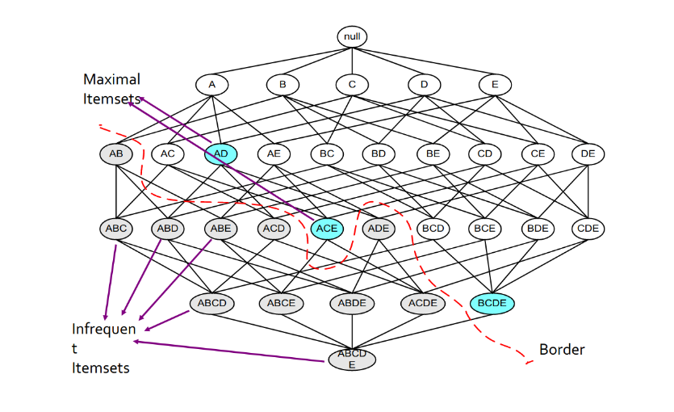
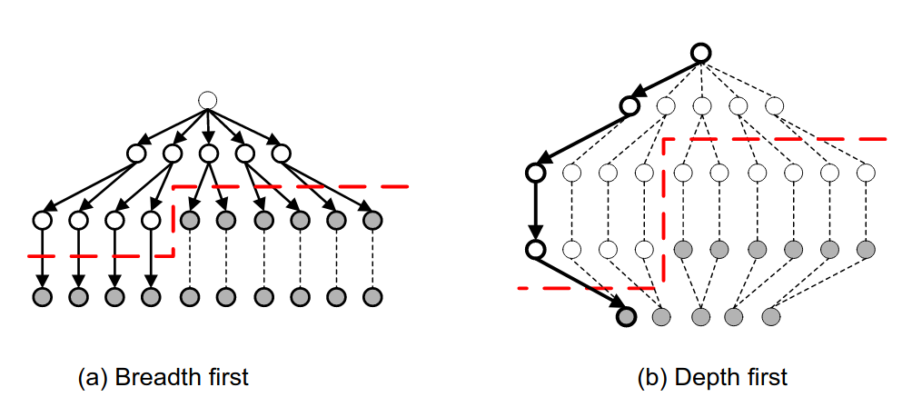
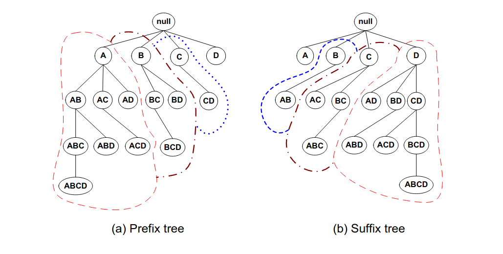
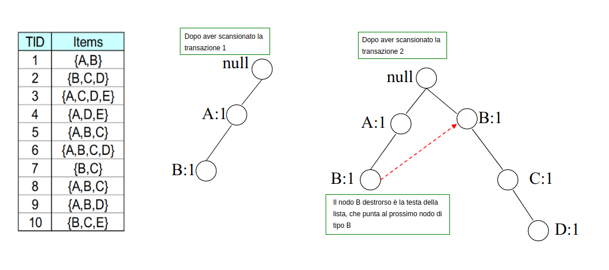
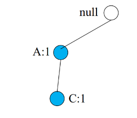
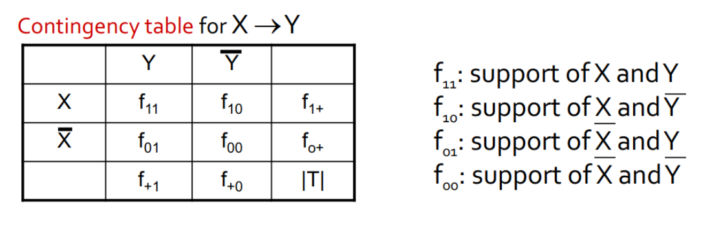

## 2. Advanced Market Basket Analysis

> Definizioni preliminari: il **power set** $pow(S)$ di un insieme $S$ è l'insieme de

### 2.1 PCY Algorithm 

L'algoritmo PCY (*Park-Chen-Yu*) applica una modifica all'algoritmo classico Apriori. Nel primo step dell'apriori, quando si effettua il conteggio degli item nei basket, la maggior parte della memoria principale resta inutilizzata. Questo algoritmo sfrutta la memoria in idle per risparmiare alcuni calcoli nello step successivo.  


#### 2.1.1 L'algoritmo

Sia $h$ una funzione hash e supponiamo che la memoria in idle sia sufficiente a far entrare $k$ bucket. La funzione hash potrebbe, ad esempio, essere definita come segue
$$
h(x,y) = [(\text{order of }x) \cdot 10 + (\text{order of }y)] \mod{k}
$$
La funzione prende in input coppie di item $(x,y)$ e da in output uno tra i $k$ bucket. Quando si scansionano i carrelli per il conteggio degli item, per ogni coppia $(x,y)$ contenuta nel carrello si calcola l'hash della coppia $h(x,y) = i$, si inserisce la coppia nel bucket $i$-esimo e si incrementa il conteggio delle coppie per quest'ultimo.  


$$
\begin{bmatrix}
\text{bucket address} 	& 0 & 1 & 2 & 3 \\
\text{bucket count} 	& 2 & 3 & 0 & 1 \\
\text{bucket contents} 	& (i_1, i_3) & (i_2, i_5) &  & (i_1, i_3)\\
						& (i_1, i_3) & (i_2, i_5) &  & \\
						&  & (i_7, i_9) &  & \\
\end{bmatrix}
$$
Notiamo che, se $minsup = 2$, allora sicuramente le coppie di item che finiranno in bucket con un conteggio minore di 2 non saranno frequenti. Tuttavia, la tabella hash è pesante da mantenere in memoria, quindi scremiamo la struttura creando un array di bit di lunghezza $k$ (uno per ogni bucket), in cui asseriamo solo i bit il cui corrispondente bucket ha un conteggio maggiore o uguale a $minsup$. 
$$
[1,1,0,0]
$$
Eliminiamo dalla memoria la tabella hash e manteniamo l'array di bit. Nella generazione delle coppie candidate ad essere frequenti, controlliamo con la funzione di hash se $h(x,y)$ ricade in un bit posto a 0, ed in tal caso scartiamo la coppia, o posto ad 1, quindi la manteniamo come candidata. 

> Supponendo che, al posto della tabella hash, si fosse tenuto in memoria il vettore dei conteggi, ogni conteggio avrebbe occupato 4byte. Con il vettore di bit, per ogni bucket si occupa $\frac{1}{32}$ di quello che si occuperebbe utilizzando il conteggio. 

Questo metodo non ammette falsi negativi: se il conteggio di un bucket non supera la soglia $minsup$, allora una coppia contenuta nel bucket, che sarà presente nei carrelli al più tante volte quanto è il conteggio nel bucket, non supererà anch'essa la soglia. 

> Osservazione: se al conteggio delle coppie utilizziamo una matrice triangolare, lo spreco in termini di spazio è lo stesso (se non maggiore, a causa del vettore di bit) dell'apriori tradizionale. Se con la tabella hash riuscissimo ad eliminare almeno $\frac 2 3$ dei candidati, allora potremmo utilizzare una tabella di triple (item, item, count) e risparmiare comunque spazio, avendo un algoritmo più performante sotto tutti gli aspetti. 


#### 2.1.2 Raffinamento 

Un ulteriore raffinamento consiste nell'utilizzare più funzioni hash, vediamo due metodi: il **multistage** ed il **multihash**. 

Nel metodo multistage si aggiunge un passo intermedio dove, ai risultati dell'hashing al passo uno, viene applicata una ulteriore funzione hash e prodotto un ulteriore bit-vector con meno falsi positivi. Questo metodo richiede tre passaggi. 

Nel metodo multihash si utilizzano già al passo uno due funzioni hash $h_1$ ed $h_2$. Si tengono due tabelle hash in memoria che mantengono il conteggio degli elementi. Alla fine si producono 2 bit vector $b_1$ e $b_2$. Una coppia sarà selezionata come candidata se e solo se i bit, per entrambe funzioni hash, in AND risultano 1, altrimenti in uno dei due conteggi la coppia non risulta frequente. 


### 2.2 Random sampling

L'algoritmo random sampling proviene dalla statistica: possiamo pensare che prendendo un campione del nostro insieme di carrelli, e riducendo anche la soglia di frequenza $minsup$ (ad esempio $\frac{s}{125}$), i risultati siano pressoché quelli reali, ammettendo un certo numero di falsi positivi e falsi negativi. 

> Osservazione: ridurre eccessivamente la soglia $s$ comporta che la maggior parte degli insiemi saranno considerati frequenti, quindi un'aumento dell'utilizzo della memoria. 

Nello specifico, prendiamo un campione dalla popolazione che entri in memoria principale. Così facendo, risparmiamo nei tempi di IO dell'algoritmo ed operiamo in-place. Opzionalmente, è possibile verificare che le coppie risultate frequenti siano realmente frequenti sul dataset originale. 


### 2.3 SON Algorithm 

L'algoritmo SON (*Savasere-Omiecinski-Navathe*) consiste nel leggere dal disco sottoinsiemi di basket di grandezza proporzionale alla memoria, e dopodiché eseguire l'apriori (in memoria) su di essi, scalando opportunamente la soglia $minsup$. Un itemset diventa candidato ad essere frequente se è frequente in **almeno uno** dei sottoinsiemi processati. In un secondo passaggio, si verifica che i candidati ad essere frequenti siano frequenti in tutto il dataset. Anche in questo algoritmo si sfrutta l'idea chiave della monotonicità: un insieme non può essere frequente se non lo è almeno in un sottoinsieme. 


#### 2.3.1 Algoritmo distribuito

La computazione del SON è particolarmente semplice da distribuire su più calcolatori: ogni calcolatore prende un sottoinsieme del dataset di carrelli e processa il risultato. I risultati vengono distribuiti e viene accumulato il loro conteggio. I candidati vengono poi verificati in un secondo passaggio. 


#### 2.3.2 Map-Reduce

Implementiamo le due fasi dell'algoritmo secondo il paradigma map-reduce, sfruttando 2 map-reduce in cascata. 


##### Fase 1 - trovare i candidati

Ad ogni nodo viene inviato un sottoinsieme del dataset di carrelli. Ogni chunk conterrà come valore un elenco parziale di transazioni (carrelli), mentre la chiave non sarà importante. Scaliamo il supporto $s$ in base al numero di chunk prodotti, quindi riferiamoci al supporto scalato (o locale) come $s_L$. 

```python
# k (chiave): nulla
# v (valore): elenco parziale di basket 
# sl: supporto locale
# apriori: algoritmo apriori che prende in input set di basket ed un supporto. 
# emit: emette una coppia (chiave, valore)

def map(k,v): 
	IS = apriori(v, Sl)
	for itemset in IS:
        emit(itemset, 1)

# k (chiave): itemset frequenti in (almeno) un sottoinsieme 
# v (valore): 1 (non serve)

def reduce(k, v): 
    emit(k, 1)
```


##### Fase 2 - trovare gli insiemi frequenti

Mettiamo in cache i candidati ottenuti dalla fase 1 in un insieme $C$. Nuovamente inviamo ad ogni nodo un sottoinsieme del dataset di carrelli. Nella *map*, per ogni itemset candidato si conteggia il supporto locale nel sottoinsieme di carrelli e si emette. Nella reduce, si sommano i supporti locali per ogni itemset e, se il supporto totale supera la soglia $s$, allora si emette l'itemset frequente ed il suo supporto. 

```python
# C : candidati in cache ottenuti dalla fase 1
# k (chiave): nulla 
# v (valore): elenco parziale di basket
# count: conteggia le occorrenze dell'itemset nell'elenco parziale di basket

def map(k,v): 
    for itemset in C:
        supp = count(itemset, v)
        if (supp > 0):
            emit(itemset, supp)

# k (chiave): itemset
# v (valore): insieme dei supporti per ogni subset di carrelli
# s : supporto

def reduce(k,v):
    supp = 0
    # passo ottimizzabile 
    for local_sup in v:
        supp += local_sup
	if supp > s:
        return (k, supp)
```


### 2.4 Algoritmo di Toivonen

L'algoritmo di Toivonen introduce il concetto di **frontiera negativa**. Il processing può essere fatto come nel random sampling o come nel SON, l'unica cosa che varia è la selezione dei candidati: oltre a considerare i candidati confrontando il conteggio con un supporto **locale**, il che potrebbe introdurre falsi negativi (potenziali candidati non rilevati), si considerano i candidati che stanno nella frontiera negativa. 

> Un itemset $\{i_1, \dots, i_n\}$ sta nella frontiera negativa se e solo se non è frequente e tutti i suoi sottoinsiemi sono frequenti. 

Si può dimostrare che introdurre il concetto di frontiera negativa da un contributo importante nell'individuazione di veri positivi tra i candidati, mentre aumenta di poco il numero di falsi positivi. 


### 2.5 Rappresentazioni compatte 

Tra i fattori che influenzano la complessità della ricerca di itemset frequenti vi sono: 

* La scelta del supporto minimo
* Numero di items (grosse strutture per il conteggio)
* Dimensione del dataset
* Larghezza media delle transazioni

Nell'esempio sottostante abbiamo che, dato l'insieme frequente $\{A_1, \dots, A_{10}\}$, tutti i sottoinsiemi (ovvero l'insieme delle parti, meno che l'insieme vuoto) sono anch'essi frequenti e tutti con lo stesso supporto. Vediamo come comprimere l'analisi andando a sacrificare l'informazione fornita dal supporto. 


#### 2.5.1 Insiemi frequenti massimali

Osserviamo il seguente lattice: 



La frontiera rossa separa gli insiemi frequenti (colore bianco) dagli insiemi non frequenti (colore grigio). Gli insiemi colorati in azzurro sono insiemi frequenti massimali. Un insieme frequente si dice **massimale** quando ogni suo superinsieme (insieme che lo contiene) non è frequente. 

Conservando solo gli insiemi massimali trasportiamo una importante informazione: l'insieme delle parti (power set) di un insieme frequente massimale è formato da soli insiemi frequenti. Ovviamente, mantenendo solo gli insiemi frequenti massimali, si perde il supporto dei sottoinsiemi frequenti, che potrebbe essere maggiore. Di conseguenza, mantenere solo gli insiemi frequenti massiamali equivale ad una compressione con perdita (**lossy**). 


#### 2.5.2 Insiemi frequenti chiusi

Se non si è disposti a perdere una informazione preziosa come il supporto, è possibile conservare solamente gli insiemi frequenti **chiusi**: si definisce insieme frequente chiuso, un insieme frequente quale ogni superset, quindi ogni insieme formato a partire da esso, ha un supporto minore. 

Conservando ogni insieme **chiuso**, sappiamo ogni insieme facente parte del suo power set ha lo stesso identico supporto. Non essendoci perdita di informazione, mantenere solo gli insiemi frequenti chiusi equivale ad una compressione senza perdita (**lossless**). Tuttavia, il numero di insiemi chiusi è spesso maggiore del numero di insiemi massimali. 

Supponiamo che nell'esempio il supporto minimo sia 2: 


Gli insiemi evidenziati in giallo sono insiemi frequenti chiusi (o lo sono parzialmente). ${B}$ ha un supporto maggiore di $\{A,B\}$, quindi va conservato comunque. Tuttavia, $\{A\}$ ha lo stesso supporto di $\{A,B\}$, quindi può essere scartato e derivato in seguito come membro del powerset di quest'ultimo. 

> Gli insiemi massimali sono un sottoinsieme degli insiemi chiusi, che a loro volta sono un sottoinsieme degli insiemi frequenti. 


### 2.6 Generazione dei candidati

L'algoritmo Apriori, e tutti i suoi derivati, attraversarno il lattice con una visita in ampiezza (prima gli itemset di cardinalità $k$, poi quelli di cardinalità $k+1$, etc). La visita in ampiezza può essere condotta in vari modi:  

* **General-to-specific**: bottom-up, incrementando la dimensione degli itemset
* **Specific-to-general**: top-down, spezzattando progressivamente gli itemset 
* **Bidirectional**: proseguendo in entrambe le strade contemporaneamente


Inoltre è possibile pensare ad una visita in profondità per la generazione dei candidati, come vediamo in esempio: 



O ancora, anziché utilizzare il lattice completo, costruire un **prefix-tree** o un **suffix-tree**, dividendo gli itemset in classi di equivalenza. Così facendo, si riducono le strade da percorrere: nel caso del prefix-tree, dal nodo $A$ si diramano tutti i possibili itemset che iniziano per $A$, mentre dal nodo $B$ si diramano tutti gli itemset che iniziano per $B$ e che non contengono $A$, poiché questi ultimi saranno presenti nel sottoalbero di $A$. 




### 2.6 Database invertito e cenni di ECLAT

Abbiamo sempre considerato il database delle transazioni come una tabella contenente da una parte l'ID della transazione, e dall'altra gli item contenuti. È possibile utilizzare un indice invertito per rappresentare la stessa cosa: costruiamo una tabella avente, per ogni item, le transazioni che lo contengono (TID-list). Per capire se un itemset è frequente, basterebbe intersecare TID-list degli item contenuti e confrontare la cardinalità con il supporto minimo. 


Nell'esempio, per sapere se $\{A,B\}$ è frequente basta intersecare l'insieme delle transazioni di $A$ con quello di $B$. Se il numero di transazioni in comune è maggiore del supporto, allora l'itemset $\{A,B\}$ è frequente. 


#### 2.6.1 ECLAT

L'algoritmo ECLAT (*Equivalence Class Clustering and bottom-up Lattice Traversal*) determina il supporto di un qualsiasi $k$-itemset intersecando le TID-list di due sottoinsiemi qualsiasi di dimensione $(k-1)$.


### 2.7 FP-growth

Il FP-growth (Frequent-Pattern growth) è un algoritmo di estrazione degli insiemi frequenti che utilizza una rappresentazione compressa del database sfruttando un FP-tree. Una volta costruito il FP-tree,  l'algoritmo utilizza un metodo ricorsivo divide-and-conquer per rilevare gli insiemi frequenti. Il vantaggio principale del FP-growth è che **non è necessaria la generazione dei candidati**. Inoltre, non sarà necessario scannerizzare più volte il database per conteggiare gli itemset, in quanto può essere fatto direttamente dal FP-tree in maniera efficiente. 


#### 2.7.1 Costruzione del FP-tree

**Step 1:** Per ogni transazione, si rimuovono gli item con frequenza inferiore al supporto minimo, dopodiché si ordinano i rimanenti in ordine decrescente rispetto al loro supporto. 

> Nell'esempio visto a lezione, lo step 1 non esiste. Semplicemente le transazioni sono già ordinate. 

**Step 2**: Per ogni transazione, si mappano gli item nell'albero: per ogni item, se dalla radice non vi è nessun figlio contenente il nodo, allora si crea un altro nodo figlio e si inizializza il contatore ad 1. Se esiste, si incrementa di 1 il contatore, si scende al nodo e si prosegue con il prossimo item. 



Per ogni item $u$ unico si tiene una linked-list che parte dal nodo $u$ destrorso nell'albero, che linka al successivo nodo $u$, e così via. Inoltre, una **header table** contiene i puntatori alle teste (head) di tutte le linked-list. In questo modo risulta semplice trovare nell'albero tutte le occorrenze di itemset contenenti un certo item.


#### 2.7.2 Costruzione dei pattern condizionali

Partiamo dalla fine della header-table e costruiamo il pattern condizionale $P$ per $E$. Evidenziamo solo i cammini che finiscono per $E$ ed effettuiamo il pruning di tutto il resto. 


Osserviamo che viene ricalcolato il conteggio sulla base di $E$: il conteggio di $A$ è adesso 2, poiché $A$ partecipa a 2 cammini che coinvolgono $E$. Costruire l'albero condizionale per $E$ è analogo a ricostruire un FP-tree considerando come transazioni solo i cammini che finiscono per $E$. 
$$
P = \{
(A:1, C:1, D:1, E:1 ), 
(A:1, D:1, E:1 ),
(B:1, C:1, E_:1 )
\}
$$
Il conteggio di $E$ è 3, per cui se supponiamo che $minsup = 2$, allora diciamo che $\{E\}$ è un itemset frequente. Consideriamo l'albero condizionale di $E$ ed applichiamo ricorsivamente la stessa procedura con $D$: 


I pattern condizionali per $\{E,D\}$ sono: 
$$
P=\{
(A:1, C:1, D:1), 
(A:1, D:1)
\}
$$
Il conteggio è 2, per cui anche $\{E,D\}$ risulta essere frequente. Applichiamo ricorsivamente la procedura per $C$ analizzando i pattern per $\{E,D,C\}$: 



È presente un solo cammino, quindi il count per $\{E,D,C\}$ equivale ad 1 (non frequente), quindi lo rigettiamo. Proviamo con $A$: 


Il conteggio di $\{E,D,A\}$ vale 2, quindi l'insieme è frequente. Abbiamo completato la ricerca degli insiemi frequenti per $E$, adesso la procedura va ri-eseguita sull'item $D$ e così via. 


#### 2.7.3 Il metodo frequent pattern growth 

Ricapitolando, l'idea è quella di estendere i pattern frequenti. Il metodo consiste nei seguenti passi: 

* Per ogni item frequente, costruire la sua base dei pattern condizionali, dopodiché il suo FP-tree condizionale.
* Si ripete il processo su ogni FP-tree condizionale generato sino a quando esso non risulta vuoto. 


#### 2.7.4 Scalare il FP-growth 

Se il FP-tree non entra in memoria, è necessario adottare delle tecniche per rendere l'algoritmo scalabile. La tecnica adoperata è la DB projection (proiezione del database): si partiziona il database in un insieme di database proiettati, dopodiché si costruisce un FP-tree per ogni database proiettato e si esegui il mining. 

> Se gli item sono $\{A,B,C\}$ e l'item su cui proiettare il database è $A$, allora la proiezione è fatta come segue: si considerano gli item con cui è possibile estendere $A$, e si scrive $E(A) = \{B, C\}$. Dopodiché si effettua l'intersezione tra ogni carrello nel database e l'insieme $E(A)$. Il database risultante ha una dimensione minore. 

Le proiezioni possono essere fatte su tutto il database (**parallel projection**) per ogni item frequente oppure si può partizionare il database in base alle proiezioni (**partition projection**), il che risulta non essere ridondante ([link al paper](https://link.springer.com/content/pdf/10.1023/B:DAMI.0000005258.31418.83.pdf)). 


### 2.8 Multiple Minimum Support

Molti dataset reali hanno una distribuzione ripida del supporto dei propri item. Se il supporto minimo è troppo alto potremmo perdere alcuni itemset che includono item rari, mentre se è troppo basso il costo computazionale risulta troppo alto. Una idea è quella di applicare diversi supporti minimi in base all'item (o alla categoria), da questa idea prende il nome di **multiple minimum support**. 


#### 2.8.1 Perdita dell'anti-monotonicità

Esempio, sia $MS(i)$ il supporto minimo per l'item $i$: 

* $MS(Milk) = 5\%$
* $MS(Coke)=3\%$
* $MS(Broccoli)=0.1\%$
* $MS(Salmon)=0.5\%$

Ipotizziamo di star analizzando il supporto dell'itemset $\{Milk, Broccoli\}$, quale supporto minimo dovremmo utilizzare? La risposta è il supporto minimo **più piccolo**. Quindi: 
$$
MS(\{Milk, Broccoli\}) = \min(MS(Milk), MS(Broccoli)) = 0.1\%
$$
**Problema**: il supporto non è più [anti-monotono](https://link.springer.com/referenceworkentry/10.1007%2F978-0-387-39940-9_5046)! Supponiamo che:  

* $Support(Milk, Coke) = 1.5\%$ 
  * in questo caso il supporto minimo più basso è quello di $Coke$, ovvero $3\%$, quindi l'itemset non è frequente. 
* $Support(Milk, Coke, Broccoli)=0.5\%$ 
  * il supporto minimo più piccolo è quello di $Broccoli$, ovvero $0.1\%$, quindi l'itemset è frequente, tuttavia **contiene un itemset non frequente** al suo interno. 


#### 2.8.2 Soluzione - MS Apriori

Si ordinano in **maniera crescente** gli item in base al loro supporto minimo, basandoci sull'esempio precedente avremo: 
$$
\langle Broccoli, Salmon, Coke, Milk \rangle
$$
Sarà necessario modificare l'algoritmo Apriori come segue: 

* $L_1$ sarà l'insieme degli item frequenti
  * Ogni item è filtrato in base al proprio supporto minimo
  * Per $L_k$ si prenderà il supporto minimo più piccolo nell'itemset
* $F_1$ sarà l'insieme di item il cui supporto è $\ge MS(1)$ (supporto minimo più basso)
  * Se un item non supera il supporto minimo più piccolo allora di sicuro non supererà gli altri supporti. 
  * $F_1$ potrebbe (spesso lo è) più grande di $L_1$ 
* $C_2$ è il set di coppie candidate generate da $F_1$ anziché $L_1$. 


##### Procedura

Ordiniamo gli item in $I$ in maniera crescente sulla base del supporto minimo $MS$. 

* $M = sort(I, MS)$
* $F = \{ i \mid i \in I, supp(i) \ge MS(M[1]) \}$
* $L = \{i \mid i \in F, supp(i) \ge MS(i) \}$
* for ($k=2$, $L_{k-1} \ne \empty$, $k++$) do:
  * Se $k = 2$ allora $C_k = cgen(F)$
  * Altrimenti $C_k = cgen(L_{k-1})$
  * per ogni transazione $t$ nel database $T$
    * per ogni candidato $c$ in $C_{k}$
      * $c = sort(c)$
      * $supp(c) = supp(c) + count(c, t)$
  * $L_k = \{c \mid c \in C_k, supp(c) \ge MS(c[1])\}$
* return $\bigcup_{k} L_k$

Notiamo che, dato che $c$ viene ordinato con $sort$, allora $MS(c[1])$ indica il supporto minimo più basso nell'itemset $c$. 


### 2.9 Rule generation

Dopo aver trovato gli itemset frequenti, è necessario generare delle regole. Una regola di associazione è una regola del tipo $A\to B$, e si interpreta come: "Se il carrello contiene $A$, conterrà anche $B$". Definiamo la confidenza della regola $A \to B$ come segue: 
$$
c(A \to B) = \frac{support(AB)}{support(A)}
$$
Sia $L$ un itemset frequente, si trovino tutti i sottoinsiemi propri $F \sub L$ tali che la confidenza della regola $F \to (L\setminus F)$ superi la soglia di confidenza minima. Se $|L| = k$ allora vi saranno $2^k-2$ candidati (conteggiamo i membri del powerset escludendo l'insieme vuoto $\empty$ e l'insieme $L$ stesso). 


#### 2.9.1 Generazione efficiente di regole

In generale, la confidenza non è anti-monotona, quindi $c(ABC \to D)$ può essere maggiore o minore di $c(AB \to D)$. Tuttavia, osserviamo un fatto: consideriamo la regola $ABC \to D$ e calcoliamo la confidenza: 
$$
c(ABC \to D) = \frac{support(ABCD)}{support(ABC)}
$$
Ora spostiamo la $C$ al membro di destra: 
$$
c(AB \to CD) = \frac{support(ABCD)}{support(AB)}
$$
Dalla anti-monotonia del supporto possiamo asserire che:
$$
support(AB) \ge support(ABC) \Longrightarrow 
\frac{1}{support(AB)} \le \frac{1}{support(ABC)} \Longrightarrow \\
\Longrightarrow \frac{support(ABCD)}{support(AB)} \le \frac{support(ABCD)}{support(ABC)} \Longrightarrow c(AB \to CD) \le c(ABC \to D)
$$
Da cui proviene il **teorema**: 

> Se una regola $X \to (Y \setminus X)$ non soddisfa la soglia minima di **confidenza**, allora qualsiasi regola $X' \to (Y \setminus X')$, dove $X' \subseteq X$, non soddisferà la soglia minima di confidenza.  

È quindi possibile effettuare pruning nel lattice delle regole di associazione: se $ABC \to D$ non supera la soglia di confidenza minima, allora le regole $AB \to CD$, $AC \to BD$, $A \to BCD$ (etc.) non soddisferanno la soglia minima di confidenza. 


#### 2.9.2 Pattern evaluation

Esistono molte metriche per validare la valenza di una regola di associazione. Possono essere utilizzate per effettuare un pruning nel post-processing, o in altri casi, un pruning online. 


##### Tavola di contingenza

La tavola di contingenza è una tabella da cui vengono calcolate varie metrice. È definita come segue: 




##### Drawback of confidence 

Analizziamo la seguente tabella di contingenza: 


Analizziamo la regola $\text{Tea} \to \text{Coffee}$. La confidenza è pari a: 
$$
c(\text{Tea} \to \text{Coffee}) = \frac{15}{20} = 0.75
$$
Possiamo codificare il fatto in termini di probabilità condizionata, quindi scriveremo che la probabilità $P(\text{Coffee}\mid \text{Tea}) = 0.75$. Osserviamo due fatti: 

* $P(\text{Coffee}) = \frac{90}{100} = 0.90$
* $P(\text{Coffee}\mid \bar{\text{Tea}}) = \frac{75}{80} \approx 0.94$

Quindi la probabilità che, non comprando il Te, si compri il caffè è ancora più alta della regola studiata in precedenza, per cui possiamo concludere che: pur avendo una buona confidenza, la regola $\text{Tea} \to \text{Coffee}$ risulta ambigua e poco interessante.


##### Ulteriori metriche

* Lift, definito come $\frac{P(Y \mid X)}{P(Y)}$
* Interest, definito come $\frac{P(X,Y)}{P(X)P(Y)}$
* PS (Piatetsky-Shapiro's), definito come $P(X,Y) - P(X)P(Y)$
* $\phi$-coefficient, definito come $\frac{P(X,Y) - P(X)P(Y)}{\sqrt{P(X)[1-P(X)][1-P(Y)]}}$

E molte altre. 

|      |      |      |
| ---- | ---- | :--- |
|      |      |      |
|      |      |      |
|      |      |      |
|      |      |      |


