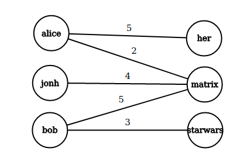

## 4. Sistemi avanzati di raccomandazione

È possibile trovare una introduzione ai sistemi di raccomandazione nel testo [*Dive Into Data Mining*](https://github.com/LemuelPuglisi/DiveIntoDataMining). 

### 4.1 LSI - Latent Semantic Indexing (LSI)

Il LSI è una tecnica sviluppata nei primi anni '90 che risolve il problema della sparsità e scalabilità per grandi dataset nel contesto semantico. Consiste principalmente nel ridurre la dimensionalità e catturare le relazioni latenti su matrici *termini-documenti*. Questa tecnica di indicizzazione utilizza la decomposizione SVD per identificare pattern nella relazione tra termini e concetti contenuti nel testo: si basa sul principio che parole utilizzate nello stesso contesto tendono ad avere significato simile. 

#### 4.1.1 LSI per sistemi di raccomandazione

È possibile applicare la tecnica LSI nel contesto dei sistemi di raccomandazione:

* La matrice *termini-documenti* sarà sostituita con la *matrice di utilità* $M$
* Le categorie degli item prenderanno il posto dei concetti
* Il mapping $\text{termini} \to \text{concetti}$, $\text{documenti} \to \text{concetti}$ diviene $\text{item} \to \text{categorie}$, $\text{utenti} \to \text{categorie}$

Quindi si calcola la SVD della matrice $M$: 
$$
M = U\Lambda V^T
$$
Dalle proprietà della SVD sappiamo che le matrici $U$ e $V$ sono matrici dense.Sia $p$ il vettore contenente tutte le valutazioni effettuate dall'utente $x$ sugli $n$ item, supponendo che se l'utente $x$ non ha valutato l'item $j$, allora $p_j = 0$.  Calcoliamo
$$
\bar{p} = p \times V \\
\bar{p} = \begin{bmatrix}
\bar{p}_1 & \dots & \bar{p}_r 
\end{bmatrix} = 
\begin{bmatrix}
p_1 & \dots & p_n 
\end{bmatrix} \times 
\begin{bmatrix}
v_{11} & \dots & v_{1r} \\
v_{21} & \dots & v_{2r} \\
\dots \\
v_{n1} & \dots & v_{nr} \\
\end{bmatrix} 
$$
dove $V$ è la matrice di dimensione $n \times r$ della decomposizione che rappresenta la corrispondenza film-categorie. Così facendo, mappiamo le valutazioni correnti dell'utente dallo spazio originale a quello delle categorie. Calcoliamo la predizione della valutazione dell'utente $x$ su tutti i film come segue
$$
\hat{p} = \bar{p} \times V^T
$$

### 4.2 Metodi Graph-based

I metodi graph-based sfruttano una idea simile a quella del collaborative filtering, ma utilizzano un grafo bipartito per immagazzinare le informazioni. Le raccomandazioni sono ottenute a partire dalla struttura della rete bipartita. 

Sia $G(U,O,E,W)$ un grafo bipartito, in cui $U$ di cardinalità $n$ ed $O$ di cardinalità $m$ sono due classi di identitià indicanti rispettivamente gli utenti e gli oggetti. Sia $E$ l'insieme degli archi
$$
E = \{e_{ij} : u_i \text{ valuta } o_j \}
$$
E $W$ una funzione peso $W:E\to R$ che rappresenta il grado di preferenza espresso dall'utente per un particolare oggetto.  La utility matrix corrisponde alla matrice di adiacenza del grafo bipartito. 

#### 4.2.1 NBI - Network-based inference 

La network-based inference è una tecnica sviluppata nel 2007 in cui si effettuano delle proiezioni sul grafo bipartito per ottenere informazioni. Dal grafo definito in precedenza è possibile estrarre due proiezioni: la proiezione rispetto agli utenti e quella rispetto agli oggetti. In una proiezione vi sono nodi appartenenti allo stesso insieme e due nodi sono connessi se e solo se sono connessi ad almeno un nodo in comune dell'altro insieme nel grafo $G$ di partenza. 

#### 4.2.2 Idea dell'NBI 

Sia $G$ il grafo bipartito definito in precedenza, definiamo una matrice di adiacenza $A$ dove
$$
a_{ij} = \begin{cases}
1 \text{ se i nodi sono connessi } \\
0 \text{ altrimenti }
\end{cases}
$$
Si esegue un processo di trasferimento delle risorse (*resource transfer*) tra i due insiemi della rete: all'inizio vengono trasferite delle risorse dall'insieme $O$ all'insieme $U$ e, successivamente, le risorse tornano da $U$ ad $O$. La risorsa contenuta in un nodo viene trasferita equamente ai nodi adiacenti nell'altro insieme. Il processo a due fasi si ripete sino a convergenza. Questo metodo ci permette di definire una tecnica per il calcolo della matrice dei pesi $W$ di dimensione $n \times n$ di una **proiezione** di $G$ rispetto all'insieme $U$ come segue: 
$$
w_{ij} = \frac{1}{\Gamma(i,j)} \sum_{l=1}^{m} \frac{a_{il}a_{jl}}{k(u_l)}
$$
Quindi iteriamo per tutti gli $m$ item in $O$ e, se l'item è in comune tra i due utenti $i$ e $j$, allora $w_{ij}$ acquisisce valore inversamente proporzionale al grado $k(u_l)$ dell'oggetto. La funzione $\Gamma$ è arbitraria e definisce il metodo graph-based utilizzato: 
$$
\Gamma(i,j) = \begin{cases}
k(o_j) \text{ per il metodo NBI } \\ 
k(o_i) \text{ per il metodo HeatS }
\end{cases}
$$
Per ottenere le predizioni delle valutazioni, ovvero la matrice di raccomandazione $R$, è sufficiente computare il prodotto riga-colonna tra la matrice $W$ dei pesi della proiezione del grafo bipartito (sugli utenti), che ha una dimensione $n \times n$, per la matrice $A$ di adiacenza del grafo bipartito $G$, che ha una dimensione $n \times m$ 
$$
R = W \cdot A
$$
Il peso $w_{ij}$ della proiezione corrisponde a quante risorse vengono trasferite dall'oggetto $j$ all'oggetto $i$, o quanto piacerà l'oggetto $j$ ad un utente a cui piace l'oggetto $i$. 

> Il NBI funziona su tutti i tipi di oggetti e risolve il problema della sparsità della utility matrix. Tuttavia persistono i problemi con i nuovi utenti o i nuovi item ed il metodo richiede importanti risorse computazionali. 

[Paper di riferimento](https://academic.oup.com/bioinformatics/article/29/16/2004/199066?login=true).

### 4.3 Metodi ibridi

I metodi ibridi sfruttano una combinazione di diversi metodi di raccomandazione, risultando essere dei meta-sistemi. Supponiamo di avere due metodi $X$ ed $Y$ che diano rispettivamente gli score $x_a$ e $y_a$. Lo score di un modello ibrido può essere ottenuto come: 
$$
z_a  = (1 - \lambda) \frac{x_a}{\max_{\beta}x_{\beta}} 
	+ \lambda \frac{y_a}{\max_{\beta}y_{\beta}} \text{  con } \lambda \in [0,1]
$$
I valori sono normalizzati per lo score massimo che il rispettivo metodo di raccomandazione ha ottenuto. Il modello è generalizzabile per l'utilizzo di $n$ sistemi di raccomandazione. 

>La valutazione dei risultati di un sistema di raccomandazione consiste spesso nel calcolare il *root mean square error* (RMSE) tra le valutazioni reali dell'utente e le predizioni del sistema. Una alternativa sta nell'interpretare il problema come un task di classificazione binaria, dove con 1 indichiamo una relazione tra utente e item e viceversa con 0. Di conseguenza sarà possibile calcolare metriche come la precision e la recall, o disegnare la curva ROC. 

### 4.4 BellKor Recommender System

Il BellKor Recommender System è il sistema di raccomandazione che ha vinto il [Netflix Prize](https://en.wikipedia.org/wiki/Netflix_Prize). Combina tre fattori principali: gli effetti globali, la fattorizzazione ed il collaborative filtering. 

#### 4.4.1 Introduzione 

Il collaborative filtering sfutta un criterio globale ed uno locale per effettuare la predizione finale, di fatto la raccomandazione $r_{xi}$ dell'utente $x$ per l'item $i$ è ottenuta dalla seguente espressione: 
$$
\hat{r}_{xi} = b_{xi} + \frac 
{\sum_{j \in N(x;i)} s_{ij} \cdot (r_{xj} - b_{xj}) }
{\sum_{j \in N(x;i)} s_{ij} }
$$
Dove con $b_{xi}$ intendiamo la baseline per l'utente $x$ rispetto all'item $i$ e con $s_{ij}$ intendiamo la similarità tra gli item $i$ e $j$. Tale espressione vale nel caso degli item-item CF; nel caso degli user-user CF è sufficiente trasporre la matrice di utilità. 

Il criterio globale nell'espressione consiste nell'utilizzo della baseline. La baseline è data dalla somma della media globale delle valutazioni $\mu$, la deviazione $b_i$ delle valutazioni sul film $i$ rispetto alla media, la deviazione $b_x$ delle valutazioni dell'utente $x$ rispetto alla media. Quindi $b_{xi} = \mu + b_i + b_x$. Supponiamo che la media delle valutazioni sia $3.7$ stelle. Il film "Sesto senso" è valutato $0.5$ stelle sopra la media; l'utente Joe valuta i film $0.2$ sotto la media. La baseline estimation del rating di Joe per "sesto senso" è $3.7 + 0.5 - 0.2 = 4$ stelle. Tutte le informazioni utilizzate per il calcolo della baseline sono informazioni globali. Attraverso delle informazioni locali ottenute (ad esempio) attraverso il collaborative filtering, è possibile effettuare una predizione più precisa. L'espressione 10 fornisce tutto ciò che serve per il calcolo della predizione finale. 

#### 4.4.2 Parametri arbitrari 

L'espressione 10 presenta un parametro totalmente arbitrario: la misura di similarità. La similarità influenza in maniera diretta il risultato del sistema, e quindi le dipendenze tra gli utenti (o tra gli item). È possibile sostituire la similarità $s_{ij}$ con dei pesi $w_{ij}$ calcolati attraverso un processo di training. Quindi riscriviamo l'espressione 10
$$
\hat{r}_{xi} = b_{xi} + \sum_{j \in N(x;i)} w_{ij} (r_{xj} -  b_{xj})
$$
Dove $w_{ij} \in \R$ è un peso di interpolazione che modella l'interazione tra gli oggetti (o gli utenti), indipendente  dall'utente. Assumiamo che: 
$$
\sum_{j \in N(x;i)} w_{ij} \ne 1
$$

#### 4.4.3 Primo problema di ottimizzazione 

La matrice di utilità è un dataset contenente dei dati reali, con cui possiamo confrontare i risultati del nostro sistema. Avendo le predizioni $r_{xi}$ e sapendo calcolare la predizione $\hat{r}_{xi}$, i pesi $w_{ij}$ saranno l'incognita da trovare. A questo punto si utilizza un algoritmo di ottimizzazione per minimizzare il SSE (*sum of square errors*) calcolato sui dati di training (n.b. si utilizza il SSE anziché il RMSE poiché la derivata è più semplice). 

La objective function $J$ da ottimizzare sarà la seguente: 
$$
J(w) = \sum_{x,i} \left( 
	\left[ b_{xi} + \sum_{j \in N(x;i)} w_{ij} (r_{xj} -  b_{xj}) \right] 
	- r_{xi}
\right)^2 
$$
Un algoritmo di ottimizzazione possibile è la discesa del gradiente: sia $\eta$ il *learning rate*, aggiorniamo la nostra matrice di pesi $w$ come segue: 
$$
w \leftarrow w - \eta \nabla_w J
$$
e ripetiamo sino a convergenza. Anche se nell'espressione è presente il gradiente $\nabla_w J$, in realtà si parla di matrice Jacobiana poiché $w$ presenta 2 dimensioni. Nel nostro caso avremo
$$
\nabla_w J = \left[\frac{\partial J(w)}{\partial w_{ij}}\right] = 
2\sum_{x,i} \left( 
	\left[ b_{xi} + \sum_{j \in N(x;i)} w_{ij} (r_{xj} -  b_{xj}) \right] 
	- r_{xi}
\right) (r_{xj} - b_{xj})
$$
$\forall i,x \and j \in N(i;x)$ , quindi $j$ vicino ad $i$, altrimenti avremo: 
$$
\frac{\partial J(w)}{\partial w_{ij}} = 0
$$

#### 4.4.4 Fattori latenti 

Sia $R$ la matrice di utilità, effettuiamo la scomposizione SVD e riduciamo la dimensionalità a $k$ fattori latenti, otteniamo: 
$$
R \approx U\Sigma V^T 
$$
Sia $Q = U$ e $P^T = \Sigma V^T$, allora:
$$
R \approx QP^T
$$
Per stimare l'elemento $r_{xi}$ della matrice $R$ è sufficiente effettuare il prodotto scalare tra la $i$-esima riga di $Q$ e la $x$-esima colonna di $P^T$ (o analogamente, la $x$-esima riga di $P$)
$$
\hat{r}_{xi} = \sum_f q_{if} \cdot p^T_{fx} = \sum_f q_{if} \cdot p_{xf}
$$

#### 4.4.5 Secondo problema di ottimizzazione

La SVD non è applicabile quando nella matrice $R$ vi sono elementi non definiti. Tuttavia è possibile ovviare al problema ricavando le matrici $Q$ e $P$ attraverso i metodi di ottimizzazione. Consideriamo la seguente funzione obiettivo (*sum of squared errors, SSE*):
$$
J (P, Q) = \sum_{(i,x) \in R} \left( r_{xi} - q_{i} \cdot p_{x} \right)^2
$$
Con $q_i$ indichiamo la $i$-esima riga della matrice $Q$, con $p_x$ indichiamo la $x$-esima riga della matrice $P$. Il metodo non richiede che le due matrici siano ortonormali. Sia $k$ il numero di fattori latenti, si osserva empiricamente che l'ottimizzazione soffre di problemi di *overfitting* già per $k > 2$. 

Introduciamo la regolarizzazione nella funzione obiettivo basandoci sull'idea che una maggiore quantità di valutazioni permette una predizione più accurata per un determinato utente. Geometricamente, si interpreta posizionando l'utente (vettore di valutazioni) lontano dal centro (quindi predizione più sicura) se il numero di valutazioni effettuate è alto. Nella pratica aggiungiamo il termine tra parentesi quadre: 
$$
J (P,Q) = \sum_{(i,x) \in R} \left( r_{xi} - q_{i} \cdot p_{x} \right)^2
+ \left[ \lambda_1\sum_{x}||p_x||^2 + \lambda_2\sum_{x}||q_i||^2 \right]
$$
Dove $\lambda_1, \lambda_2$ sono parametri che permettono di eseguire un tuning sul peso della regolarizzazione. Anche questa volta è possibile utilizzare l'algoritmo di discesa del gradiente, iterando sino a convergenza ed aggiornando le matrici come segue
$$
P \leftarrow P - \eta \nabla P \\
Q \leftarrow Q - \eta \nabla Q 
$$
Dove $\nabla Q$ indica il gradiente (o più correttamente, la matrice jabobiana) della funzione obiettivo $J$ rispetto a $Q$: 
$$
\nabla Q = \left[ \nabla q_{if} \right]  \\
\nabla q_{if} = 
\left[ \sum_{x,i} 2(r_{xi} - {q_q \cdot p_x})(-p_{xf}) \right] + 2\lambda_2q_{if}
$$
Ed analogo il calcolo di $\nabla P$. 

#### 4.4.6 Stochastic Gradient Descent 

Il calcolo del gradiente nell'algoritmo di discesa del gradiente è particolarmente oneroso, supponiamo di stare effettuando l'ottimizzazione per un regressore lineare $h_{\theta}$: 
$$
h_{\theta}(x^{(i)}) = \sum_{j=1}^n \theta_j x^{(i)}_j
$$
Supponiamo che la funzione obiettivo $J(\theta)$ sia definita come segue
$$
J(\theta) = \frac{1}{2m} \sum_{i=1}^m \left( h_{\theta}(x^{(i)}) - y^{(i)} \right)^2
$$
Quindi lo step di aggiornamento dell'algoritmo di discesa del gradiente sarà: 
$$
\theta_j = \theta_j - \eta \frac{1}{m} \sum_{i=1}^m \left( h_{\theta}(x^{(i)}) - y^{(i)} \right) x^{(i)}_j \text{ per } j = 1 \dots n
$$
Ovvero per ogni coefficiente $\theta_j$ si calcola la derivata parziale della funzione obiettivo $J$ sull'intero training set. Se la dimensione del training set $m$ è particolarmente grande, i dati saranno molto probabilmente conservati in memoria secondaria. L'algoritmo risulta quindi molto pesante. Supponiamo di definire una funzione costo: 
$$
\text{cost}(\theta, (x^{(i)}, y^{(i)})) = \frac{1}{2} \left( 
h_{\theta}(x^{(i)}) - y^{(i)}
\right)^2
$$
Quindi riscriviamo la funzione costo come
$$
J(\theta) = \frac{1}{m} \sum_{i=1}^m \text{cost}(\theta, (x^{(i)}, y^{(i)}))
$$
L'algoritmo di discesa del gradiente *stocastico* (*Stochastic Gradient Descent*, SGD) consiste in due step ripetuti in maniera iterativa: 

* Permutare casualmente il training set 
* Aggiornare i coefficienti come segue

$$
\text{per } i = 1, \dots, m \text{ eseguire: } \\
\theta_j = \theta_j - \alpha \left( h_{\theta}(x^{(i)}) - y^{(i)} \right) x^{(i)}_j \text{ per } j = 1 \dots n
$$

Osserviamo che all'interno dello step di aggiornamento vi è la derivata parziale della funzione costo anziché della funzione obiettivo: questo implica che, ad ogni step, i pesi vengono aggiornati basandosi su una singola osservazione del training set e non su tutti i dati. 

Lo stochastic gradient descent è molto più rapido dell'algoritmo di discesa del gradiente classico. Tuttavia, la convergenza ad un minimo locale della funzione obiettivo risulta essere più instabile e necessita di più step.

#### 4.4.7 Costruzione del modello

È possibile combinare il predittore baseline con le interazioni utente-film ottenute attraverso la scomposizione in fattori latenti: 
$$
\hat{r}_{xi} = \mu + b_x + b_i + q_i \cdot p_x
$$
Quindi minimizzare la funzione obettivo così proposta
$$
J(Q,P, b_x, b_i) = 
\sum_{(i,x) \in R} \left( r_{xi} - (\mu + b_x + b_i + q_i \cdot p_x) \right)^2 + \\
+ \left[ 
\lambda_1\sum_{x}||p_x||^2 + 
\lambda_2\sum_{x}||q_i||^2 +
\lambda_3\sum_{x}||b_x||^2 +
\lambda_4\sum_{x}||b_i||^2 +
\right]
$$
In questo caso sia le interazioni $q_i$ e $p_x$ che i bias $b_x$ e $b_i$ sono trattati come parametri da stimare e vengono aggiunti termini di regolarizzazione anche per i bias. 

#### 4.4.8 Bias temporali

Una ulteriore miglioria al modello consiste nel legare i bias $b_i$ e $b_x$ ed i fattori $p_x$ e $q_i$ al tempo, sotto la considerazione che la valutazione di un film tende ad essere stabile per i film vecchi ed instabile per i film nuovi. 
$$
\hat{r}_{xi} = \mu + b_x(t) + b_i(t) + q_i(t) \cdot p_x(t)
$$

> La soluzione del team "BellKor's Pragmatic Chaos" vincitore del Netflix prize consiste nell'eseguire un blend lineare dei risultati di diversi tipi di predittori (approssimativamente 500) che sfruttano i concetti mostrati, ottenendo un miglioramento del 10.09%.