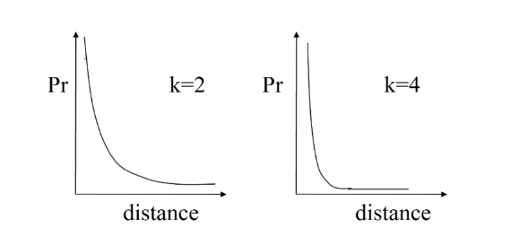
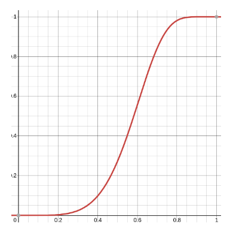
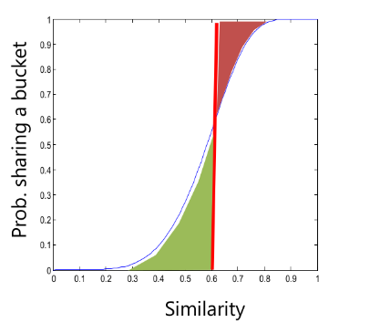
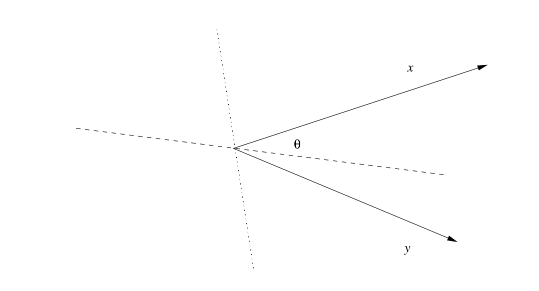
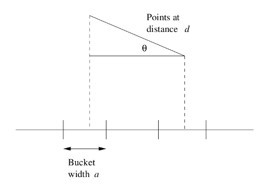

## 5. Finding Similar Items 

Un problema noto è la ricerca di item simili: supponiamo di voler esaminare le pagine web per cercare casi di plagio. Un approccio naive consisterebbe nel calcolare la distanza di ogni coppia di pagine; tuttavia questo approccio risulta proibitivo nel caso di grandi dataset poiché quadratico.

### 5.1 Similarità tra insiemi

Supponiamo di rappresentare i documenti (i.e. pagine web) come insiemi. Un modo di calcolare la similarità tra due insiemi $S$ e $T$ è la similarità di Jaccard, definita come il rapporto tra la cardinalità dell'intersezione e dell'unione dei due insiemi: 
$$
sim(S,T) = \frac{|S \cup T|}{|S \cap T|} \in [0,1]
$$

> Dare una lettura al sottocapitolo 3.1 di 'Mining of massive datasets' di Ullman et al. 

### 5.2 Shingling 

Il metodo più efficace per rappresentare insiemisticamente dei documenti, allo scopo di identificare documenti lessicalmente simili, consiste nel creare un insieme a partire dalle stringhe contenute nel testo. Due documenti simili avranno stringhe (es. parole o frasi) simili. Una semplice tecnica per ottenere un insieme da un documento testuale è lo shingling. 

#### 5.2.1 $k$-Shingles 

Un documento è una stringa di caratteri. Si definisca un $k$-shingle di un documento come una qualsiasi sottostringa di lunghezza $k$ nel documento. Dopodiché vengono associati al documento un insieme di $k$-shingles ed (opzionalmente) la loro frequenza assoluta.

#### 5.2.2 Lunghezza dello shingle 

Scegliendo un valore $k$ troppo piccolo, ci aspetteremo che quasi tutte le sequenze di $k$ caratteri siano presenti nella maggioranza dei documenti. Così facendo, ogni coppia di documenti avrebbe una similarità di Jaccard molto alta.  

> $k$ deve assumere un valore grande abbastanza, tale che la probabilità che un qualsiasi shingle appaia in un qualsiasi documento sia bassa. 

Nel caso di un corpus di email, $k = 5$ dovrebbe funzionare bene: supponendo che si incontrino solo caratteri alfabetici e spazi bianchi, allora avremo $27^5=14,348,907$ shingle. Essendo che una email è molto più corta del numero indicato, la probabilità che uno tra gli shingle appaia nel documento risulta essere bassa. 

#### 5.2.3 Hashing shingles

Sia $A$ l'insieme dei caratteri possibili in un documento e supponiamo, per semplicità, che essi siano 27. Per $k = 9$ abbiamo $(27)^9$ possibili shingle. Ogni carattere occupa un byte, quindi un intero shingle occuperà 9 byte. Possiamo applicare una funzione di hashing che mappa ogni shingle in un numero tra $0$ e $(27)^9-1$: 
$$
h: A^9 \to \{0, 1, \dots, (27)^9-1\}
$$
Così facendo, ogni shingle sarà rappresentato da un intero a 4 byte. Lo spazio occupato sarà $\frac 4 9$ rispetto alla rappresentazione originale. 

#### 5.2.4 Costruire shingle da parole

Supponiamo di osservare una pagina web contenente un articolo con un certo topic. Come distinguiamo le stringhe provenienti dall'articolo dagli altri contenuti della pagina? Si osserva che gli articoli, come la maggior parte dei contenuti scritti in prosa, contengono molte stop words (congiunzioni, articoli, punteggiatura), ovvero parole poco significative nella distinzione del contenuto. 

Tuttavia, si è dimostrato empiricamente che la tripla formata da una stop words e le due parole seguenti formano uno shingle molto efficace. In questo modo l'articolo contribuirà di più alla formazione degli shingle e la distinzione sarà basata su elementi provenienti dall'articolo piuttosto che dagli elementi circostanti della pagina web. La similarità di Jaccard sarà più alta per documenti con articoli simili rispetto a documenti con elementi circostanti all'articolo simili. 

### 5.3 Min-Hashing

Gli shingle possibili sono moltissimi e, all'aumentare dei documenti, potrebbe essere impossibile tenere tutto in memoria principale. L'obiettivo principale è quello di sostituire grandi insiemi di shingle con una rappresentazione molto più piccola, chiamata ***signature*** (*firma*). La proprietà più importante che vogliamo rispettare è che, comparando le *signature* di due documenti, la similarità di Jaccard sia approssimativamente analoga a quella che si otterrebbe comparando i loro rispettivi insiemi di shingle. 

#### 5.3.1 Rappresentazione matriciale degli insiemi

Prima di tutto occorre costruire una *characteristic matrix*. In questa matrice, la $j$-esima colonna rappresenta l'insieme di shingle estratto dal $j$-esimo documento, mentre la $i$-esima riga indica l'$i$-esimo shingle tra tutti gli shingle possibili. 

> Esempio: supponiamo di avere 100 documenti, 27 caratteri possibili e $k=5$. Per ogni documento estraiamo l'insieme di shingle. Nella matrice vi saranno 100 colonne (una per l'insieme di ogni documento) e $27^5$ righe (una per ogni possibile shingle). 

L'elemento $(i,j)$ della matrice varrà 1 se lo shingle $i$ è contenuto nell'insieme $S_j$ degli shingle del documento $j$, altrimenti varrà 0. Chiamiamo *universal set* l'insieme di tutti i possibili shingle.

#### 5.3.2 Min-hashing

Le signatures degli insiemi che vogliamo ottenere sono composte dai risultati di centinaia di calcoli, chiamati ***minash*** della characteristic matrix. Supponiamo di avere la seguente matrice: 
$$
\begin{array}{c c} &
	\begin{array}{c c c c} S_1 & S_2 & S_3 & S_4 \\
	\end{array} \\
	\begin{array}{c c c c c}
	a \\
	b \\
	c \\
	d \\
	e \\
	\end{array}
& \left[
	\begin{array}{c c c c}
	1 & 0 & 0 & 1 \\
	0 & 0 & 1 & 0 \\
	0 & 1 & 0 & 1 \\
	1 & 0 & 1 & 1 \\
	0 & 0 & 1 & 0 \\
	\end{array}
\right]
\end{array}
$$
Per calcolare il minhash è necessario effettuare una permutazione delle righe, supponiamo che la prima permutazione sia $\pi_1 = <b,e,a,d,c>$ e riscriviamo la matrice: 
$$
\begin{array}{c c} &
	\begin{array}{c c c c} S_1 & S_2 & S_3 & S_4 \\
	\end{array} \\
	\begin{array}{c c c c c}
	b \\
	e \\
	a \\
	d \\
	c \\
	\end{array}
& \left[
	\begin{array}{c c c c}
	0 & 0 & 1 & 0 \\
	0 & 0 & 1 & 0 \\
	1 & 0 & 0 & 1 \\
	1 & 0 & 1 & 1 \\
	0 & 1 & 0 & 1 \\
	\end{array}
\right]
\end{array}
$$
Dopodiché utilizziamo una funzione hash $h_{\pi_1}()$ su ogni insieme $S_i$ (colonne). Tale funzione ritorna in output la prima riga dell'insieme che presenti un 1:  
$$
h_{\pi_1}(S_1) = a \\
h_{\pi_1}(S_2) = c \\
h_{\pi_1}(S_3) = b \\
h_{\pi_1}(S_4) = a
$$
Quindi il minhash corrisponde a $(a,c,b,a)$. Questo processo si ripete $m$ volte, dove $m$ è solitamente molto più piccolo della cardinalità dell'insieme universale. Una volta calcolato il minhash da una permutazione, esso va inserito come riga di una matrice, chiamata ***signature matrix***: 
$$
\begin{array}{c c} &
	\begin{array}{c c c c} S_1 & S_2 & S_3 & S_4 \\
	\end{array} \\
	\begin{array}{c c c c c}
	\pi_1 \\
	\dots \\
	\dots \\
	\end{array}
& \left[
	\begin{array}{c c c c}
	a & c & b & a \\
	&\dots \\
	&\dots \\
	\end{array}
\right]
\end{array}
$$
Una volta ripetuto $m$ volte il processo con $m$ diverse permutazioni, la **signature** dell'insieme $S_i$ corrisponderà alla colonna $i$-esima della signature matrix. Per semplicità, definiamo una funzione hash $h$ (notare l'assenza di permutazione al pedice) che rappresenti il processo di calcolo di una signature $h(S_i)$ a partire da un insieme di shingle $S_i$. 

#### 5.3.3 Min-hashing e Similarità di Jaccard

Vogliamo che valga la proprietà fondamentale per cui: 
$$
sim(S_i, S_j) \approx sim^*(h(S_i), h(S_j))
$$
Dove $sim^*$ indica una particolare similarità tra signature che corrisponde alla frazione di minhash in cui esse coincidono:
$$
sim^*(h(S_i), h(S_j)) = \frac
{\text{numero di righe in cui } h_{\pi_j}(S_i) = h_{\pi_j}(S_j)}
{\text{numero totale di righe}}
$$

##### Teorema 1

Si può dimostrare che:  
$$
P( h_{\pi}(S_i) = h_{\pi}(S_j) ) = sim(S_i, S_j)
$$
Sia $S_i$ l'insieme di shingle e $y \in S_i$ un elemento dell'insieme, allora: 
$$
P(\pi(y) = h_{\pi}(S_i)) = \frac{1}{|S_i|}
$$
Dove con $\pi(y)$ indichiamo l'indice di $y$ nella permutazione $\pi$. Possiamo affermare ciò poiché ogni elemento dell'insieme ha equa probabilità di essere primo nella permutazione $\pi$. 

> Nota bene: la cardinalità $|S_i|$ corrisponde al numero di shingle contenuti nell'insieme, ovvero al numero di elementi nella colonna $i$-esima posti ad 1.

Vogliamo studiare la probabilità che si verifichino i due eventi: 
$$
\pi(y) = h_{\pi}(S_i) \text{ se } y \in S_i  \text{ e }
\pi(y) = h_{\pi}(S_j) \text{ se } y \in S_j \\
$$
Quindi che $y$ sia l'elemento di indice 1 nella permutazione $\pi$ in entrambi gli insiemi $S_i$ ed $S_j$ (ammesso che vi sia). La probabilità è sempre distribuita uniformemente, ma adesso è necessario considerare che tutti gli elementi dell'unione $S_i \cup S_j$ sono candidati ad essere primi, quindi: 
$$
P\left(\pi(y) = h_{\pi}(S_i) \and  \pi(y) = h_{\pi}(S_j)\right) = \frac{1}{|S_i \cup S_j |}
$$
Se volessimo trovare la probabilità che il primo elemento sia uguale in entrambi gli insiemi $S_i$ ed $S_j$, è necessario considerare tutti gli elementi della loro intersezione come possibili candidati, dove ogni elemento ha probabilità uniforme, quindi: 
$$
P\left(h_{\pi}(S_i) = h_{\pi}(S_j)\right) = \frac{|S_i \cap S_j |}{|S_i \cup S_j |} = sim(S_i, S_j)
$$
Il che dimostra la nostra tesi. 

##### Teorema 2

Per semplicità, abbreviamo: 
$$
sim^*(S_i, S_j) \equiv sim^*(h(S_i), h(S_j))
$$
Sia $s$ una soglia di similarità al di sopra della quale consideriamo due insiemi di shingle "altamente simili". Supponiamo che $s$ sia limitato inferiormente da una costante $c$. Allora vale il seguente teorema: 

Siano $0 < \delta < 1$, $\epsilon > 0$, e $k > 2 \delta^{-2}c^{-1}\log{\epsilon^{-1}}$, allora per ogni coppia di insiemi $S_i, S_j$ valgono le seguenti proprietà:
$$
\text{a) }  sim(S_i, S_j) \ge s \ge c \Longrightarrow P(sim^*(S_i, S_j) \ge (1-\delta)s) \ge 1 - \epsilon \\
\text{b) }  sim(S_i, S_j) \le c \Longrightarrow P(sim^*(S_i, S_j) \le (1-\delta)c) \ge 1 - \epsilon \\
$$
Dove $\epsilon$ e $\delta$ sono parametri arbitrari; il teorema ci permette di limitare il numero di falsi positivi e falsi negativi (controllare l'errore). Dimostriamo la proprietà a) 
$$
\text{a) }  sim(S_i, S_j) \ge s \ge c \Longrightarrow P(sim^*(S_i, S_j) \ge (1-\delta)s) \ge 1 - \epsilon
$$
Scriviamo: 
$$
P(sim^*(S_i, S_j) < (1-\delta)s) < \epsilon
$$
Banalmente, poiché se l'evento $A$ accade con probabilità $p$, allora l'*evento complementare o contrario* $A^C$ accade con probabilità $1-p$. 

Grazie al teorema precedente, possiamo asserire: 
$$
P\left(h_{\pi}(S_i) = h_{\pi}(S_j)\right) = \frac{|S_i \cap S_j |}{|S_i \cup S_j |}
$$
Usiamo $k$ funzioni hash, quindi $k$ permutazioni e definiamo una variabile aleatoria $X$ come segue: 
$$
X = X_1 + X_2 + \dots + X_k
$$
Con
$$
X_l = \begin{cases}
1 \text{ se } h_{l}(S_i) = h_{l}(S_j) \\
0 \text{ altrimenti}
\end{cases} \text{ per } l = 1, \dots, k
$$
Osserviamo che
$$
P(X_l = 1) = \frac{|S_i \cap S_j |}{|S_i \cup S_j |} = p
$$
La variabile aleatoria $X$ è distribuita secondo una distribuzione binomiale, $X \sim Bi(k, p)$. Il valore atteso è noto e corrisponde a: 
$$
E[X] = kp = k \cdot \frac{|S_i \cap S_j |}{|S_i \cup S_j |} = k \cdot sim(S_i, S_j)
$$
Poiché la similarità originale $sim$ corrisponde proprio alla similarità di Jaccard. 

Sappiamo che la similarità tra signatures $sim^*$ corrisponde al numero di volte in cui i minhash corrispondono (casi favorevoli) rispetto al numero di minhash totali, quindi scriviamo: 
$$
sim^*(S_i, S_j) = \frac{X}{k}
$$
Anche questa è una variabile aleatoria, il cui valore atteso corrisponde a: 
$$
E\left[\frac{X}{k}\right] = \frac 1 k E[X] = \frac 1 k \cdot k \cdot sim(S_i, S_j) = sim(S_i, S_j) 
$$
Quindi la similarità tra signatures è un estimatore corretto della similarità di Jaccard tra gli insiemi. Questo vuol dire che al crescere del numero di funzioni hash applicate, per la legge dei grandi numeri, l'estimatore converge al parametro stimato. Utilizziamo adesso un importante teorema, chiamato **Chernoff Bound**, che enuncia: 
$$
P(X < (1 - \delta) E[X]) < \exp(-\frac{\delta^2E[X]}{2})
$$
Riscriviamo l'espressione dettata dal Chernoff Bound sostituendo i protagonisti e ricordandoci di aver considerato il complementare nell'espressione (17):
$$
P(sim^*(S_i, S_j) < (1 - \delta)s )
= P\left(\frac{X}{k} < (1-\delta)s\right) 
= P\left(X < (1-\delta)sk\right)
$$
Per ipotesi, sappiamo che: 
$$
sim(S_i, S_j) \ge s
$$
Quindi possiamo sostituire nella disequazione (26) $s$ con la similarità di Jaccard: 
$$
P(X < (1 - \delta) \cdot k \cdot sim(S_i, S_j))
$$
Essendoci ricondotti al valore atteso di $X$ (vedasi espressione 22), è possibile applicare il Chernoff Bound: 
$$
P(X < (1 - \delta) \cdot k \cdot sim(S_i, S_j)) < \exp(-\frac{\delta^2E[X]}{2}) = \\ 
= \exp(-\frac{\delta^2 k \cdot sim(S_i, S_j)}{2}) \le \\
\le \exp(-\frac{\delta^2 k \cdot s}{2}) < \epsilon
$$
Fissati $\epsilon$ e $\delta$, ricaviamo la quantità $k$ (funzioni hash necessarie ad ottenere un certo controllo dell'errore) risolvendo la disequazione: 
$$
\exp(-\frac{\delta^2 k \cdot s}{2}) < \epsilon		\Longrightarrow 
-\frac{\delta^2 k \cdot s}{2} < \log \epsilon		\Longrightarrow 
\frac{\delta^2 k \cdot s}{2} > \log \epsilon^{-1}	\Longrightarrow
k > 2\delta^{-2}s^{-1}\log \epsilon^{-1}
$$
Quindi la proprietà è dimostrata. 

#### 5.3.4 Row hashing 

Effettuare una permutazione è una operazione molto dispendiosa. Una ingegnerizzazione del min-hashing, chiamata row-hashing, permette di effettuare lo stesso procedimento rapidamente. Supponiamo di avere $d$ documenti $S_1, \dots, S_d$ e $k$ funzioni hash $h_1, \dots, h_k$ del tipo: 
$$
h(x) = [(ax + b) \mod p] \mod N
$$
Dove $a$ e $b$ sono due interi arbitrari, $p$ è un numero primo, $N$ è il numero di shingle e si ha che $p > N$.  Sappiamo a priori che la matrice delle signatures avrà dimensione $k \times d$. La procedure consiste nei seguenti passi: 

* Inizializzare la matrice delle signatures $S$ ad $\infty$.
* Per ogni riga (termine) $i = 0, \dots, N$ 
  * Per ogni funzione hash $j = 0, \dots, k$ 
    * Generare l'indice $h_j(i)$ della riga $i$ nella permutazione data da $h_j$ 
    * Per ogni documento $l = 0, \dots, d$ controllare se all'indice $h_j(i)$ vi è un 1. 
      * Se è così, allora se l'elemento $S_{jl}$ è maggiore di $h_j(i)$ 
        * $S_{jl} \leftarrow h_j(i)$

Vediamo un esempio: 
$$
\begin{array}{c c} &
	\begin{array}{c c c c} S_1 & S_2 & S_3 & S_4 \\
	\end{array} \\
	\begin{array}{c c c c c}
	0 \\
	1 \\
	2 \\
	3 \\
	4 \\
	\end{array}
& \left[
	\begin{array}{c c c c}
	1 & 0 & 0 & 1 \\
	0 & 0 & 1 & 0 \\
	0 & 1 & 0 & 1 \\
	1 & 0 & 1 & 1 \\
	0 & 0 & 1 & 0 \\
	\end{array}
\right]
\end{array}
$$
Supponiamo di avere $k=2$ funzioni hash definite come segue: 
$$
h_1(x) = (x+1) \mod{5} \\
h_2(x) = (3x+1) \mod{5}
$$
Che generano le due permutazioni: 
$$
\begin{array}{c c} &
	\begin{array}{c c} h1 & h_2\
	\end{array} \\
	\begin{array}{c c c c c}
	0 \\
	1 \\
	2 \\
	3 \\
	4 \\
	\end{array}
& \left[
	\begin{array}{c c}
	1 & 1 \\
	2 & 4 \\
	3 & 2 \\
	4 & 0 \\
	0 & 3 \\
	\end{array}
\right]
\end{array}
$$
Inizializziamo la matrice delle signatures: 
$$
\begin{array}{c c} &
	\begin{array}{c c c c} S_1 & S_2 & S_3 & S_4 \\
	\end{array} \\
	\begin{array}{c c}
	h_1 \\
	h_2 \\
	\end{array}
& \left[
	\begin{array}{c c c c}
	\infty & \infty & \infty & \infty \\
	\infty & \infty & \infty & \infty \\

	\end{array}
\right]
\end{array}
$$
La riga $i=0$ della characteristic matrix ha indici $(1,1)$ nelle permutazioni generate dalle funzioni hash. I documenti $S_1$ ed $S_4$ hanno valore 1 nella prima riga, quindi possiamo aggiornare la matrice delle signatures come segue: 
$$
\begin{array}{c c} &
	\begin{array}{c c c c} S_1 & S_2 & S_3 & S_4 \\
	\end{array} \\
	\begin{array}{c c}
	h_1 \\
	h_2 \\
	\end{array}
& \left[
	\begin{array}{c c c c}
	1 & \infty & \infty & 1 \\
	1 & \infty & \infty & 1 \\

	\end{array}
\right]
\end{array}
$$
La riga $i=1$ della characteristic matrix ha indici $(2,4)$ e solo il documento $S_3$ ha valore 1, aggiorniamo: 
$$
\begin{array}{c c} &
	\begin{array}{c c c c} S_1 & S_2 & S_3 & S_4 \\
	\end{array} \\
	\begin{array}{c c}
	h_1 \\
	h_2 \\
	\end{array}
& \left[
	\begin{array}{c c c c}
	1 & \infty & 2 & 1 \\
	1 & \infty & 4 & 1 \\

	\end{array}
\right]
\end{array}
$$
La riga $i=2$ della characteristic matrix ha indici $(3,2)$; i documenti $S_2$ ed $S_4$ hanno valore 1, aggiorniamo i valori minori di quelli esistenti nella matrice delle signatures (ad esempio $S_4$ rimane lo stesso poiché $1 < 3$ e $1 < 2$): 
$$
\begin{array}{c c} &
	\begin{array}{c c c c} S_1 & S_2 & S_3 & S_4 \\
	\end{array} \\
	\begin{array}{c c}
	h_1 \\
	h_2 \\
	\end{array}
& \left[
	\begin{array}{c c c c}
	1 & 3 & 2 & 1 \\
	1 & 2 & 4 & 1 \\

	\end{array}
\right]
\end{array}
$$
Allo stesso modo, per $i=3$: 
$$
\begin{array}{c c} &
	\begin{array}{c c c c} S_1 & S_2 & S_3 & S_4 \\
	\end{array} \\
	\begin{array}{c c}
	h_1 \\
	h_2 \\
	\end{array}
& \left[
	\begin{array}{c c c c}
	1 & 3 & 2 & 1 \\
	0 & 2 & 0 & 0 \\

	\end{array}
\right]
\end{array}
$$
E per $i=4$: 
$$
\begin{array}{c c} &
	\begin{array}{c c c c} S_1 & S_2 & S_3 & S_4 \\
	\end{array} \\
	\begin{array}{c c}
	h_1 \\
	h_2 \\
	\end{array}
& \left[
	\begin{array}{c c c c}
	1 & 3 & 0 & 1 \\
	0 & 2 & 0 & 0 \\

	\end{array}
\right]
\end{array}
$$
Abbiamo costruito la matrice delle signatures senza generare effettivamente le permutazioni delle righe di ogni colonna. Questa ingegnerizzazione rende il minhashing molto più rapido. 

### 5.4 Locality Sensitive Hashing 

Calcolare la similarità tra ogni coppia di documenti presenti nel database è un task dispendioso e l'approccio naive ha un tempo $O(n^2)$. Il Locality Sensitive Hashing permette di svolgere il task in tempo lineare $O(n)$ controllando l'errore di approssimazione. 

L'idea di base consiste nel generare uno ***sketch*** per ogni oggetto (nel nostro caso un documento) tale che: 

* Sia molto più piccolo rispetto al suo numero originale di feature
* Trasformi la similarità tra due vettori di feature in una operazione di uguaglianza tra sketch 

Tale metodologia è randomizzata e corretta con alta probabilità, quindi ammettiamo un certo numero (ragolabile) di falsi positivi e falsi negativi, ed inoltre è ottima in approcci distribuiti. 

#### 5.4.1 LSH e Distanza di Hamming 

Per spiegare semplicemente il procedimento e le proprietà del LSH, prendiamo in considerazione la distanza di Hamming. Supponiamo di avere due vettori binari $p$ e $q$ con $d$ feature. La distanza di hamming è definita come
$$
D(p,q) = \text{#bits where p and q differ}
$$
Definiamo una funzione hash $h$ che prenda un insieme $I$ random di $k$ feature
$$
h(p) = \text{projection of vector p on I's coordinates}
$$
Ad esempio se $k=2$, assumendo che $I=\{1,4\}$ allora la proiezione $h(01011) = 01$.  Definiamo la similarità di Hamming come segue il rapporto tra le feature che combaciano nei due vettori binari e le feature totali: 
$$
Sim(p,q) = \frac{d - D(p,q)}{d} = 1 - \frac{D(p,q)}{d}
$$
Scegliendo casualmente una posizione $x$ nei nostri vettori binari, la probabilità che il valore di $p$ e $q$ combaci nella posizione $x$ è data proprio dalla similarità: 
$$
P(p_x = q_x) = sim(p,q) = 1 - \frac{D(p,q)}{d}
$$
Dato che la funzione hash genera un insieme $I$ di $k$ posizioni random e indipendenti tra loro, la probabilità $s^k$ che $p$ e $q$ combacino in tutte e $k$ le posizioni corrisponde a: 
$$
s^k = P(h(p) = h(q)) = \left(1 - \frac{D(p,q)}{d}\right)^k
$$
Aumentando $k$

* Aumentano il numero di posizioni nell'insieme $I$
* Aumenta la probabilità di trovare posizioni che differiscono nei due vettori binari
* Diminuisce la probabilità che i vettori binari combacino
* Diminuisce il numero di falsi positivi

#### 5.4.2 Gestire i falsi negativi

Per ridurre i falsi negativi, l'idea implementata nel LSH sta nel ripetere $L$ volte le $k$-proiezioni dei vettori e, ad ogni ripetizione, generare insiemi casuali differenti. 

Abbiamo $L$ funzioni hash $<h_1, h_2, \dots, h_L>$ e definiamo la proiezione del vettore binario $p$ come 
$$
g(p) = <h_1(p), h_2(p), \dots, h_L(p)>
$$
Dichiariamo che $p$ è simile a $q$, e scriviamo $g(p) \cong g(q)$ se **almeno una** proiezione combacia, ovvero se
$$
g(p) \cong g(q) \Longleftrightarrow\exist i \in \{1,\dots, L\} : h_i(p) = h_i(q)
$$
Più grande è $L$, ***minori saranno i falsi negativi***. 

La probabilità che $p$ e $q$ non siano simili è data dalla probabilità che tutte le proiezioni non combacino
$$
P(g(p) \not\cong g(q)) = P \bigg( 
	h_i(p) \ne h_i(q) \text{ for } i = 1, \dots, L 
\bigg)
$$
Dato che le proiezioni sono indipendenti tra loro, è possibile scomporre la congiunzione degli eventi nel prodotto delle loro probabilità e, dato che la probabilità che esse non coincidano è la stessa qualunque sia la proiezione, possiamo scrivere:
$$
P(g(p) \not\cong g(q))  = P \big( h(p) \ne h(q) \big)^L = (1 - P(h(p) = h(q)))^L = (1 - s^k)^L
$$
Infine scriviamo che $p$ è simile a $q$ con probabilità 
$$
P( g(p) \cong g(q) ) = 1 - (1 - s^k)^L
$$
Se sull'asse delle $x$ indichiamo la similarità, la funzione $f(x) =1 - (1 - x^k)^L$ ha il seguente andamento ad $S$ (per $k=5$  ed $L=10$): 

##### Esempio

 Supponiamo che $k=2$ ed $L=3$ e siano i due vettori
$$
p = 01001 \\
q = 01101
$$
Quindi procediamo a generare gli insiemi $I$ casuali: 

* per $I_1 = \{3,4\}$ abbiamo $h_1(p) =00$ e $h_2(q) = 10$, nessun match quindi proseguiamo;
* per $I_2 = \{1,3\}$ abbiamo $h_1(p) = 00$ e $h_2(q)=01$, nessun match quindi proseguiamo; 
* per $I_3 = \{1,5\}$ abbiamo $h_1(p) = 01$ e $h_2(q)=01$, match! I vettori $p$ e $q$ sono simili. 

#### 5.4.3 LSH e min-hashing 

Sia $M$ la matrice delle signatures di dimensione $m \times n$ (*m* funzioni hash ed $n$ documenti) . Dividiamo le $m$ righe in $L$ bande (o gruppi contingui) ognuna formata da $k$ righe. Sia $t$ la soglia di similarità, allora utilizzando il LSH avremo la seguente situazione: 

Se la linea rossa coincide con la soglia di similarità, l'area verde che la precede è la probabilità di incappare in un *falso positivo*, mentre l'area rossa che la succede è la probabilità di incappare in un *falso negativo*. Idealmente, vorremmo una funzione step che rifiuti tutto prima della soglia $t$, dopodiché accetti tutto. 

##### Esempio

Supponiamo che la soglia sia $t = 0.8$ e che la similarità tra due insiemi di shingle $S_1$ ed $S_2$ sia 
$$
sim(S_1, S_2) = 0.8 \ge t
$$
Consideriamo $k=5$ e $L=20$, quindi dividiamo la nostra matrice in 20 bande da 5 righe ciascuna. Per i teoremi precedenti, sappiamo che la probabilità che un minhash tra i due insiemi corrisponda all'interno della banda è: 
$$
P(h(S_1) = h(S_2)) = sim(S_1, S_2) = 0.8
$$
La probabilità che tutti i minhash corrispondano all'interno di una banda (ricordando $k=5$) è $(0.8)^5 = 0.328$. Se consideriamo $g(S_i)$ l'insieme degli hash in tutte le bande, avremo che: 
$$
g(S_1) = < h_1(S_1), \dots, h_L(S_1)> \\
g(S_2) = < h_2(S_2), \dots, h_L(S_2)> \\ 
P(g(S_1) \cong g(S_2) ) = = 1-(1-s^k)^{L} = 1-(1-0.8^5)^{20} = 0.999
$$
Quindi $S_1$ è simile ad $S_2$ con probabilità del $99.9$%. Osserviamo come si comporta la funzione con coppie dissimili, quindi supponiamo: 
$$
sim(S_1, S_2) = 0.3 < t
$$
Avremo che 
$$
P(g(S_1) \cong g(S_2) ) = 1-(1-0.3^5)^{20} = 0.047
$$
Quindi $S_1$ è simile ad $S_2$ con probabilità del $4.7$%, ovvero è poco probabile che essi risultino simili. 

##### Caso ideale

Idealmente vorremmo che 
$$
\begin{cases}
\forall S_i, S_j : sim(S_i,S_j) < t \Longrightarrow p(g(S_i) \cong g(S_j)) \approx 0 \\
\forall S_i, S_j : sim(S_i,S_j) \ge t \Longrightarrow p(g(S_i) \cong g(S_j)) \approx 1
\end{cases}
$$

#### 5.4.4 Algoritmo LSH offline

* Per ogni feature vector $p$, si calcola $g(p) = < h_1(p), h_2(p), \dots, h_L(p)> $. 
* Per ogni $i = 1,2,\dots, L$ si crea un clustering $C_i$ (insieme di cluster differente per ogni banda) tale che due feature vector $p$ e $q$ si trovino nello stesso cluster se $h_i(p) = h_i(q)$. 
* Si crea un grafo non direzionato in cui i nodi $p$ e $q$ sono connessi se esiste un cluster che li contiene entrambi. 
* Si calcolano le componenti connesse del grafo per identificare vettori simili. 

> Offline algorithm from Mining of massive datasets 
>
> If we have minhash signatures for the items, an effective way to choose the
> hashings is to divide the signature matrix into b bands consisting of r rows
> each. For each band, there is a hash function that takes vectors of r integers
> (the portion of one column within that band) and hashes them to some large
> number of buckets. We can use the same hash function for all the bands, but
> we use a separate bucket array for each band, so columns with the same vector
> in different bands will not hash to the same bucket.

### 5.4 Famiglie di funzioni LSH

L'esempio visto precedentemente è un esempio di famiglia di funzioni LSH, che possono essere combinate per distinguere coppie di punti distanti tra loro da coppie di punti vicini tra loro.

Una funzione ***locality sensitive*** è una funzione che soddisfa le seguenti 3 *condizioni*: 

* Le coppie vicine devono essere candidate con probabilità maggiore rispetto alle coppie lontane. 
* Deve assicurare l'indipendenza statistica per ogni operazione svolta. 
* Deve essere efficiente: 
  * Il tempo necessario ad identificare le coppie candidate deve essere molto minore rispetto al tempo necessario per calcolare la distanza tra tutte le coppie. 
  * Si deve poter combinare per costruire delle funzioni più potenti che permettano di evitare falsi positivi e falsi negativi. 

Una funzione ***locality sensitive*** prende in input 2 oggetti e decide se essi sono simili o meno, o perlomeno candidati ad essere simili (per poi computare la distanza successivamente su un insieme ristretto di oggetti)
$$
f(x) = f(y) \Longrightarrow \text{x e y sono oggetti simili} \\
f(x) \ne f(y) \Longrightarrow \text{x e y sono oggetti dissimili}
$$
Una collezione di funzioni locality sensitive prende il nome di ***famiglia di funzioni locality sensitive***. Diciamo che una famiglia $F$ è $(d_1, d_2, p_1, p_2)$-*sensitive* se $\forall f \in F$: 

* Se la ***distanza*** $d(x,y) \le d_1$ allora la ***probabilità*** che $f(x) = f(y)$ è almeno $p_1$ 
* Se la ***distanza*** $d(x,y) \ge d_2$ allora la ***probabilità*** che $f(x) = f(y)$ è al più $p_2$ 

 

#### 5.4.1 Amplificare una famiglia locality sensitive

##### Costruzione in AND

Si costruisca una nuova famiglia $F'$ dove ogni funzione $f \in F'$ è costruita da un insieme $R$ di cardinalità $k$ di funzioni della famiglia $F$. Asseriamo che $f$ è costruita da $R = \{f_1, \dots, f_k\}$ tale che 
$$
f(x) = f(y) \Longleftrightarrow f_i(x) =f_i(y) \space \forall\space i = 1, \dots, k
$$
Questo processo è chiamato ***costruzione in AND*** e garantisce la costruzione di una famiglia $F'$ $(d_1, d_2, p_1^k, p_2^k)$-*sensitive*. In questo modo andiamo a ridurre entrambe le probabilità e, di conseguenza, il numero di *falsi positivi*.

##### Costruzione in OR 

Si costruisca una nuova famiglia $F'$ dove ogni funzione $f \in F'$ è costruita da un insieme $B$ di cardinalità $L$ di funzioni della famiglia $F$. Asseriamo che $f$ è costruita da $R =\{f_1, \dots, f_L\}$ tale che 
$$
f(x) = f(y) \Longleftrightarrow \exist f_i \in B : f_i(x) =f_i(y)
$$
Questo processo è chiamato ***costruzione in OR*** e garantisce la costruzione di una famiglia $F'$ $(d_1, d_2, 1 - (1-p_1)^L, 1 - (1-p_2)^L)$-*sensitive*.  In questo modo andiamo ad aumentare entrambe le probabilità e, di conseguenza, riduciamo il numero di *falsi negativi*.

>  Le costruzioni in OR e in AND possono essere combinate in cascata per spingere la probabilità bassa a 0 e la probabilità alta a 1. 

##### Esempio

Partiamo da una famiglia $(.2, .8, .8, .2)$-*sensitive* ed eseguiamo una prima costruzione: 
$$
F \to F'
$$
Applicando in cascata prima una costruzione in AND con $k=4$ e dopodiché una costruzione in OR con $L=4$. 
Le probabilità $p_1$ e $p_2$ della nuova famiglia $F'$ saranno: 
$$
p_1 = 1 - (1 - 0.8^4)^4 = 0.8785 \approx 0.9\\
p_2 = 1 - (1 - 0.2^4)^4 = 0.0064 \approx 0
$$
Quindi $F'$ sarà una famiglia $(.2, .8, 1 - (1 - 0.8^4)^4, 1 - (1 - 0.2^4)^4)$-*sensitive*. Osserviamo che con questo approccio, la probabilità più bassa $p_2$ è stata schiacciata a 0. 

Se costruiamo la famiglia $F'$ in maniera inversa, quindi applicando in cascata prima l'OR e poi l'AND, avremo che le probabilità saranno: 
$$
p_1 = [1 - (1 - 0.8)^4]^4 = 0.9936 \approx 1\\
p_2 = [1 - (1 - 0.2)^4]^4 = 0.1215 \approx 0.1
$$
Quindi $F'$ sarà una famiglia $(.2, .8, [1 - (1 - 0.8)^4]^4, [1 - (1 - 0.2)^4]^4)$-*sensitive*. Invertendo il processo, la probabilità più alta $p_2$ è stata spinta verso 1.

Tentiamo adesso di costruire una famiglia applicando in cascata le seguenti costruzioni: 
$$
F \to F' \to F''
$$
Dove da $F$ ad $F'$ applichiamo prima un AND ($k$=4) e poi un OR ($L=4$) e da $F'$ ad $F''$ applichiamo prima un OR ($L=4$) e poi un AND ($k = 4$). Così facendo, le probabilità $p_1$ e $p_2$ saranno ricalcolate come segue: 
$$
p_1 = \{1 - \{ 1 - [ 1 - (1 - 0.8^k)^L ] \}^L \}^k = \{1 - \{ 1 - [ 1 - (1 - 0.8^4)^4 ] \}^4 \}^4 
\approx 1 \\
p_2 = \{1 - \{ 1 - [ 1 - (1 - 0.2^k)^L ] \}^L \}^k = \{1 - \{ 1 - [ 1 - (1 - 0.2^4)^4 ] \}^4 \}^4
\approx 0
$$
Plottando queste funzioni, avremo una curva molto più ripida che approssima meglio la step function ideale. Una soluzione del genere riduce molto bene sia il numero di falsi positivi che il numero di falsi negativi. 

#### 5.4.2 LSH su diverse distanze 

##### Min hashing 

La famiglia delle funzioni min-hash, assumendo che esse usino la distanza di Jaccard, sono 
$$
(d_1, d_2, 1-d_1, 1-d_2)\text{-sensitive}
$$
Per ogni $d_1$ e $d_2$ tale che $0 < d_1 < d_2 < 1$. Per le altre distanze non vi è alcuna garanzia che vi siano funzioni hash locality sensitive. Vedremo alcune delle più famose di seguito. 

##### Distanza di Hamming

Siano $x$ e $y$ due vettori binari di dimensione $d$, denotiamo con $h(x,y)$ la loro distanza di Hamming. Definiamo una funzione $f_i(x)$ che rappresenti l'$i$-esimo elemento del vettore $x$. Possiamo affermare che $f_i(x) = f_i(y)$ se e solo se $x$ e $y$ combaciano nell'elemento $i$-esimo. La probabilità che combacino è 
$$
P( f_i(x) = f_i(y) ) = 1-\frac{h(x,y)}{d}
$$
Possiamo definire la famiglia $F$ di funzioni locality sensitive come una famiglia
$$
\left( d_1, d_2, 1 - \frac{d_1}{d}, 1 - \frac{d_2}{d} \right)\text{-sensitive}
$$
Con $d_1 < d_2$. 

##### Distanza del coseno

La distanza del coseno ha senso in spazi aventi delle dimensioni (come gli spazi Euclidei o le versioni discrete degli spazi Euclidei). In tali spazi i punti hanno delle direzioni. La distanza del coseno tra due punti corrisponde all'angolo tra questi; tale angolo sarà definito tra 0° e 180° a prescindere da quante dimensioni sia costituito lo spazio. Possiamo calcolare la distanza del coseno calcolando prima il coseno dal rapporto tra il prodotto scalare tra i due vettori ed il prodotto tra le loro norme,  poi applicando l'arcocoseno: 
$$
d(x,y) = \arccos \left( \frac{x \cdot y}{||x|| \cdot ||y||} \right) \in [0, \pi]
$$
È possibile dimostrare che la distanza del coseno è una misura di distanza. Se volessimo normalizzare il valore della distanza tra 0 ed 1, basterebbe dividere per $\pi$
$$
d(x,y) = \frac {\theta}{\pi} =  
\frac {\arccos \left( \frac{x \cdot y}{||x|| \cdot ||y||} \right)}{\pi}
\in [0,1]
$$
Supponiamo di considerare due vettori $x$ ed $y$. Tali vettori potrebbero trovarsi in uno spazio con molte dimensioni, Tuttavia insieme definiscono un piano e l'angolo tra loro e misurato sul tale piano:

Selezionando in maniera casuale un iperpiano che passa dall'origine (asse *tratteggiato* in figura), esso intersecherà il piano formato da $x$ e $y$. Per selezionare un iperpiano in maniera casuale, selezioniamo casualmente un vettore $v$ (asse *punteggiato* in figura), che sarà il suo vettore normale, dopodiché tutti i punti ortogonali a $v$ saranno punti appartenenti all'iperpiano. 

Se effettuiamo il prodotto scalare tra $v$ ed i due vettori in figura, avremo prodotti con segni differenti: questo poiché  essi capitano in lati opposti dell'iperpiano. Se l'iperpiano fosse stato l'asse punteggiato ed il suo vettore normale l'asse tratteggiato, allora i prodotti scalari avrebbero avuto lo stesso segno poiché dalla stessa parte dell'iperpiano. 

In sintesi, preso $v$ un vettore random, definiamo la funzione hash
$$
h_v(x) = \begin{cases}
+1 \text{ se } v \cdot x \ge 0 \\
-1 \text{ se } v \cdot x < 0 
\end{cases}
$$
Se il segno è positivo, i due vettori formeranno un angolo minore di $180°$, viceversa se il segno è negativo. La famiglia $F$ di funzioni locality sensitive per la distanza del coseno è formata da funzioni $f \in F$ tale che:
$$
f(x) = f(y) \Longleftrightarrow \text{sign}(f(x)) = \text{sign}(f(y))
$$
Si dimostra che la famiglia di funzioni appena definità è una famiglia
$$
\left(d_1, d_2, \frac{(180° - d_1)}{180°}, \frac{(180 - d_2)}{\pi} \right)\text{-sensitive}
$$

> Al paragrafo 3.7.3 di Mining of massive datasets vi è un semplice trucco per la generazione degli sketch per vettori a cui deve essere applicata la distanza del coseno. Tale trucco consiste nel generare vettori casuali $v$ le cui componenti sono esclusivamente formate da +1 e -1, così che il prodotto scalare diventi la somma degli elementi a cui corrisponde un +1, a cui viene sottratta la somma degli elementi a cui corrisponde un -1.
>
> Inoltre vi è un esempio che spiega come viene stimata la distanza del coseno. Supponiamo che gli sketch tra due vettori siano $[+1,+1,-1]$ e $[-1,+1,-1]$, essendo che solo $\frac 1 3$ degl elementi combaciano, si stima come distanza un angolo di 120°.  

##### Distanza Euclidea

Per semplicità, supponiamo di trovarci in uno spazio bidimensionale. Ogni funzione hash $f$ della famiglia $F$ è associata ad una retta $r$ casuale nello spazio. Fissata una costante $a$ dividiamo la retta in segmenti di lunghezza $a$.

I segmenti sulla linea corrispondono ai b nerico punto $A$ è collocato nel bucket (segmento) in cui propria proiezione rispetto alla retta $r$ va a finire. Se la distanza tra due punti $d$ è molto più piccola rispetto alla costante $a$, allora c'è una buona chance che i due punti vengano hashati nello stesso bucket, in tal caso, la funzione $f$ dichiara che i punti sono uguali. 

**a)** Se $d \le \frac a 2$, allora vi è almeno il 50% ($p_1=\frac 1 2$) di possibilità che essi ricadano nello stesso bucket. Se l'angolo $\theta$ formato dai due punti rispetto alla retta $r$ è grande, allora la probabilità che i punti ricadano nello stesso bucket è ancora maggiore: se $\theta =90°$ rispetto ad $r$, allora i due punti ricadranno per certo nello stesso bucket (la retta che passa tra i due punti è perpendicolare alla retta $r$). 

**b)** Supponiamo che $d > a$, quindi che i punti siano distanti tra loro: per cadere all'interno dello stesso bucket è necessario che $d \cdot \cos\theta \le a$. Basti guardare la figura, proiettando la distanza sulla retta essa è più grande di $a$, quindi i punti staranno per certo in bucket differenti. Se $d \ge 2a$ allora la possibilità che i due punti ricadano nello stesso bucket è inferiore ad $\frac 1 3$: infatti affinché il coseno sia inferiore ad $\frac 1 2$ (in modo da far rientrare le proiezioni nello stesso bucket) l'angolo $\theta$ deve stare tra 60° e 90°, ma l'angolo può assumere con probabilità uniforme un valore compreso tra 0° e 90°, quindi la probabilità che assuma quel range di valori è effettivamente $\frac 1 3$. 

La famiglia appena mostrata è una famiglia $(\frac a 2, 2a, \frac 1 2, \frac 1 3)$-*sensitive*. Il problema legato a tale famiglia sono le probabilità che non variano al variare del coefficiente $a$. Tuttavia, è possibile effettuare delle costruzioni in AND ed in OR per manipolare tali probabilità. 