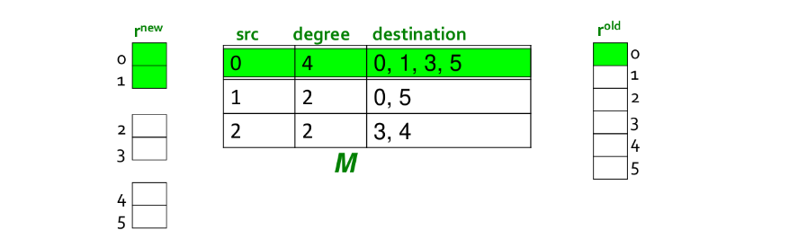

## 6. Link analysis

Il web è un grafo orientato i cui nodi sono rappresentati dalle pagine web, mentre gli archi corrispondono ai link tra le pagine. Data una query di ricerca, il problema del web search consiste nel restituire dei siti web coerenti con la query, ma soprattutto autorevoli. Il primo approccio alla navigazione web fu' la *web directory*, ovvero un elenco di siti web curati manualmente e suddivisi in maniera gerarchica. Una web directory non è un motore di ricerca e risulta essere molto limitante. Il secondo tentativo fu' proprio il web search, che consiste in due problemi: il primo problema è il più semplice, consiste nel trovare un insieme di pagine che contengono parole in comune con la query, il secondo problema è più complesso e consiste nel ritornare solo pagine web autorevoli ed evitare lo spam. 

### 6.1 PageRank

Il PageRank è un algoritmo di link analysis creato da Page, uno dei due fondatori di Google. Supponiamo di dare un valore di importanza iniziale a tutti i nodi, interpretiamo i link come dei "voti" e, se un nodo ha 10 link uscenti, allora dividerà la propria importanza equamente tra tutti e 10 i nodi. I link da pagine web importanti contano di più e tale concetto è implementabile attraverso la ricorsione. 

#### 6.1.1 Formulazione ricorsiva di base

Ogni voto di un link è proporzionale all'importanza della sua pagina sorgente. Se la pagina $j$ con importanza $r_j$ ha $n$ link uscenti, ogni link prende $\frac{r_j}{n}$ voti. L'importanza di $j$ è la somma dei voti dei suoi link entranti. Possiamo osservare che un voto da una pagina importante vale di più, e che una pagina è importante se viene puntata da altre pagine importanti. Definiamo il rank $r_j$ per la pagina $j$ attraverso una equazione di flusso 
$$
r_j = \sum_{i\to j} \frac{r_i}{d_i^{out}}
$$
Quindi il rank $r_j$ è dato dalla somma, per tutti i nodi $i$ che puntano a $j$, del voto del nodo $i$, che è calcolato dividendo la sua importanza per il suo grado uscente. Vediamo un grafo d'esempio

In questo caso avremo che 
$$
\begin{cases}
r_m = \frac{r_a}{2} \\
r_a = r_m + r_y \\ 
r_y = \frac{r_a}{2}
\end{cases}
$$
Questo è un sistema di 3 equazioni in 3 incognite con infinite soluzioni (equivalenti a meno di un fattore di scala). Un vincolo addizionale rende la soluzione unica: 
$$
r_y + r_a + r_m = 1
$$
Da cui otteniamo che $r_a = \frac 1 2$, $r_y = \frac 1 4$ ed $r_m = \frac 1 4$. Con un risolutore di equazioni lineari è possibile trovare le soluzioni per piccoli grafi. Tuttavia, il grafo del web è massivo e necessita di una nuova formulazione. 

#### 6.1.2 Formulazione matriciale

Supponiamo di avere una matrice di adiacenza $M$ per il grafo del web e consideriamo la formulazione stocastica di tale matrice, ovvero:
$$
M_{ij} = \begin{cases}
\frac{1}{d_j^{out}} \text{ if } j \to i \\
0 \text{ otherwise }
\end{cases}
$$
La riga $i$-esima della matrice indica gli archi entranti ad $i$. L'elemento $(i,j)$ vale $\frac 1 n$ se il nodo $j$, supponendo abbia $n$ archi uscenti, ha un arco uscente che punta ad $i$. Strutturando così la matrice avremo che la somma delle colonne sarà pari ad 1. 

#### 6.1.3 Vettore dei rank 

Introduciamo un vettore $r$, chiamato vettore dei rank, tale che per ogni componente $i$, $r_i$ indichi il rank del nodo $i$-esimo. Imponiamo come vincolo che la somma delle componenti sia 1, quindi $\sum_i r_i = 1$. Possiamo riscrivere l'equazione di flusso (1) nel seguente modo: 
$$
r = M \cdot r
$$
Nel prodotto riga colonna, la componente $j$ di $r$ verrà calcolata attraverso la somma dei rank dei nodi che puntano a $j$ (informazione contenuta nel vettore $r$), diviso per il loro grado uscente (informazione contenuta nella matrice $M$). Osserviamo che $r$ è un *autovettore* della matrice stocastica $M$, con corrispondente autovalore $\lambda=1$. Possiamo dire inoltre che 1 è l'autovalore più grande, essendo $M$ una matrice stocastica sulle colonne (con entry non-negative). A questo punto è possibile ottenere $r$ attraverso il metodo Power iteration: 

* Supponiamo di avere $N$ pagine web, inizializziamo $r^{(0)} = [\frac 1 N, \dots, \frac 1 N]^T$; 
* Iteriamo lo step di aggiornamento $r^{(t+1)} = M \cdot r^{(t)}$
* Fermiamo l'iterazione quando $|r^{(t+1)} - r^{(t)}|_1<\epsilon$

Calcoliamo il rank vector per l'esempio precedente (2). La matrice $M$ stocastica sarà
$$
\begin{array}{c c} &
	\begin{array}{c c c} a & m & y \\
	\end{array} \\
	\begin{array}{c c c}
	a \\
	m \\
	y \\
	\end{array}
& \left[
	\begin{array}{c c c}
	0.0 & 1.0 & 1.0 \\
	0.5 & 0.0 & 0.0 \\
	0.5 & 1.0 & 0.0 \\
	\end{array}
\right]
\end{array}
$$
Inizializziamo $r$ casualmente 
$$
r^{(0)} = \begin{bmatrix}
\frac 1 3 \\
\frac 1 3 \\
\frac 1 3 \\
\end{bmatrix}
$$
Quindi computiamo
$$
r^{(1)} = 
\begin{bmatrix}
0.0 & 1.0 & 1.0 \\
0.5 & 0.0 & 0.0 \\
0.5 & 1.0 & 0.0 \\
\end{bmatrix} \cdot
\begin{bmatrix}
\frac 1 3 \\
\frac 1 3 \\
\frac 1 3 \\
\end{bmatrix} =
\begin{bmatrix}
\frac 2 3 \\
\frac 1 6 \\
\frac 1 6 \\
\end{bmatrix}
$$
E continuiamo fino a convergenza. 

#### 6.1.4 Random walk surfer 

Immaginiamo un random web surfer, ovvero qualcuno che navighi tra le pagine del web attraverso i link. Se al tempo $t$ il surfer è sulla pagina $i$, allora al tempo $t+1$ il surfer seguirà uno tra i link uscenti di $i$ in maniera casuale ed uniforme. Il processo è ripetuto all'infinito. 

Sia $p(t)$ il vettore la cui $i$-esima componente indica la probabilità che il surfer sia alla pagina $i$ a tempo $t$. Allora $p(t)$ è la distribuzione di probabilità sulle pagine del web. Possiamo descrivere il cammino del random surfer come un processo markoviano, per cui avremo 
$$
p(t+1) = M \cdot p(t)
$$
Supponiamo che si raggiunga uno stato per cui
$$
p(t+1) = M \cdot p(t) = p(t)
$$
Allora $p(t)$ sarà la *distribuzione stazionaria* del random walk. Il nostro vettore $r$ soddisfa $r = M \cdot r$, quindi $r$ è la distribuzione stazionaria della random walk eseguita dal random web surfer. Dallo studio delle catene di Markov si evince che per grafi che soddisfano certe condizioni, la distribuzione stazionaria è ***unica*** e sarà raggiunta a prescindere da quali saranno le probabilità iniziali a tempo $t=0$. 

#### 6.1.5 Oscillazioni, dead-end e spider-trap 

In alcuni casi la computazione del page rank potrebbe non convergere. Vediamo un primo caso in cui si presenta un ciclo nella rete ed il risultato oscilla all'infinito: 

Supponiamo di inizializzare $r^{(0)} = [1, 0]^T$, allora avremo $r^{(1)} = [0, 1]^T, r^{(2)} = [1, 0]^T, \dots$ ovvero una soluzione che oscilla all'infinito e non converge mai. Osserviamo un altro caso: 

Il nodo $b$ è un *dead-end*, ovvero un nodo che non ha link uscenti. Se il random walk si trova sul nodo $b$, allora vi rimane per sempre. I nodi dead-end causano la perdita dell'importanza, fenomeno denominato *leak out*. Osserviamo un ultimo caso: 

Quando il random walker entrerà nel nodo $e$, navigherà per sempre all'interno del gruppo $e,g,f$ e non uscirà mai. Questa situazione è chiamata *spider-trap*, poiché il random walker è intrappolato all'interno del gruppo di nodi. La spider-trap assorbirà tutta l'importanza (esempio p.174, *Mining of massive datasets*). 

#### 6.1.6 Teleport 

La soluzione di Google ai problemi elencati precedentemente prende il nome di *teleport*. Ad ogni step, il random surfer ha due opzioni: 

* Con probabilità $\beta$ segue un link in modo random
* Con probabilità $1 - \beta$ salta ad un nodo random 

Valori comuni per $\beta$ sono nel range $[0.8, 0.9]$. Il surfer sarà teletrasportato fuori dalla spider-trap in un numero ragionevole di time-step. Questo approccio non solo risolve i problemi, ma riflette la realtà dei fatti: un navigatore del web può utilizzare la barra dell'URL per direzionarsi ad un'altra pagina anziché continuare a seguire i link. A questo punto illustriamo l'equazione di flusso del PageRank [*Brin-Page, '98*] 
$$
r_j = \sum_{i \to j} \beta \frac{r_i}{d_i^{out}} + (1 - \beta) \frac 1 N
$$
In questa formulazione $M$ non ha dead-end. È possibile pre-processare la matrice $M$ e rimuovere tutti i dead-end, oppure eseguire il teleport con probabilità 1 per uscire dal dead-end. Possiamo introdurre la matrice $A$ di Google formulata attraverso la precedente equazione, come: 
$$
A = \beta M + (1 - \beta)\left[\frac 1 N\right]_{N \times N}
$$
Ancora una volta è possibile applicare la power iteration per trovare il vettore dei rank $r$, infatti
$$
r = A \cdot r
$$

#### 6.1.7 Ottenere l'equazione

Aggiungere il teleport al PageRank equivale a tassare ogni pagina di una frazione $(1-\beta)$ del suo score e ridistribuirlo uniformemente tra i nodi. Partendo dall'equazione
$$
r = A \cdot r 
$$
E sapendo che $A$ è definita come nella equazione (12), possiamo scrivere che: 
$$
r_j = \sum_{i=1}^N \left[ \beta M_{ji} + \frac{1-\beta}{N} \right] \cdot r_i \\ 
= \beta\sum_{i=1}^N M_{ji} \cdot r_i + \frac{1-\beta}{N} \sum_{i=1}^N r_i
$$
Ma ricordando il vincolo $\sum_i r_i = 1$ possiamo scrivere
$$
r_j = \beta\sum_{i=1}^N M_{ji} \cdot r_i + \frac{1-\beta}{N}
$$
Che equivale a scrivere 
$$
r = \beta M \cdot r + \left[\frac{1-\beta}{N}\right]_N
$$

#### 6.1.8 Algoritmo completo

Presi in input

* Il grafo diretto $G$ (con spider-trap e dead-end)
* Il parametro $\beta$

L'algoritmo consiste nei seguenti passi: 

* Si inizializza $r^{(0)}_j = \frac 1 N$ 
* Sinché $\sum_j |r_j^{(t)} - r_j^{(t-1)}| > \epsilon$ si ripete: 
  * Per ogni $j$: 
    * $r_j^{(t+1)} = \sum_{i \to j} \beta \frac{r_i^{(t)}}{d_i}$ se $d_j^{(in)} \ne 0$ 
    * $r_j^{(t+1)} = 0$ se $d_j^{(in)} = 0$
  * Per ogni $j$: 
    * $r_j^{(t+1)} = r_j^{(t+1)} + \frac{1-S}{N}$  dove $S = \sum_j r_j^{(t+1)}$
  * Si assegna $r^{(t)} \leftarrow r^{t+1}$
* Si ritorna in output $r^{(t)}$

Si noti che nell'algoritmo non si aggiunge ad $r^{(t+1)}$ direttamente un valore $\frac {(1-\beta)} {N}$, ma si passa per una variabile intermedia $S$. Ciò è fatto per evitare di normalizzare il vettore $r$ alla fine di ogni iterazione (per rispettare il vincolo tale che la somma delle componenti sia 1). Una volta aggiornato $r^{(t+1)}$ si sommano in $S$ tutte le sue componenti e si ottiene un valore $S < 1$. Vogliamo che la somma delle componenti sia 1, quindi distribuiamo il residuo $1-S$ uniformemente alle $N$ componenti. Il passo è analogo ad aggiornare il vettore $r$ con la regola del PageRank e normalizzare alla fine. 

### 6.2 Ingegnerizzazioni del PageRank

Il passo chiave del PageRank è la moltiplicazione tra la matrice $A$ ed il vettore $r$. L'algoritmo è semplice se si ha memoria principale a sufficienza. Supponiamo che il numero $N$ di pagine sia $1$ miliardo e che ogni entry occupi $4$ byte. I vettori $r_{t+1}$ ed $r_{t}$ occupano circa $8$ GB (2 miliardi di entries). La matrice $A$ ha $N \times N$ entries, ovvero $10^{18}$, che è un numero davvero grande.   

#### 6.2.1 Matrice di adiacenza sparsa

La matrice di adiacenza del grafo del web è molto sparsa, risulta quindi insensato scegliere (nella pratica) una rappresentazione come quella matriciale. È possibile codificare la matrice utilizzando solo le entry diverse da 0, con uno spazio occupato proporzionale al numero di link (es. con le liste di adiacenza). 

#### 6.2.1 Operazioni in memoria secondaria

Supponiamo che solo $r^{(t+1)}$ stia in memoria, mentre la matrice $M$ e $r^{(t)}$ siano conservati sul disco. Possiamo modificare l'algoritmo PageRank ed operare nel seguente modo: 

* Inizializziamo tutte le entry di $r^{(t+1)}$ a $\frac{(1-\beta)}{N}$
* Per ogni nodo $i$:
  * Si legge sul disco $d_i, dest_1, dest_2, \dots, dest_{d_i}, r_i^{(t)}$ ($dest$ = outlink)
  * Per ogni $j = 1, \dots, N$ si aggiorna $r^{(t+1)}$:
    *  $r^{(t+1)}_j = r^{(t+1)}_j +  \beta \frac{r_i^{(t)}}{d_i}$

Ad ogni iterazione bisogna leggere $r^{(t)}$ ed $M$ dal disco e scrivere $r^{(t+1)}$ su disco, quindi il costo per iterazione del power method è $2|r| + |M|$. 

#### 6.2.2 Aggiornamento block-based

Se lo spazio in memoria principale non fosse sufficiente ad ospiare $r^{(t+1)}$, si potrebbe pensare di suddividere il vettore in $k$ blocchi che entrano in memoria. In tal caso si scansionerebbero $M$ ed $r^{(t)}$ una volta per ogni blocco, con un costo per iterazione di power method pari a $k(|r| + |M|) + |r|$. 

Tuttavia possiamo ottimizzare l'algoritmo escludendo del lavoro inutile: ipotizziamo di avere in memoria il blocco di $r$ di indici $[0,1]$. Iniziando per $0$, andiamo a recuperare la lista di adiacenza e controlliamo i suoi outlink. Supponiamo che gli outlink di 0 siano $[1,5,6]$, allora anziché aggiornare tutti gli outlink di 0, si aggiornano solo quelli contenuti nel blocco, in questo caso $[1]$. 

#### 6.2.3 Block-Stripe Update Algorithm

Nel paragrafo precedente abbiamo un algoritmo che, per ogni iterazione, legge la matrice $M$ (che è molto più grande di $r$) $k$ volte. Per evitare questa lettura continua è possibile suddividere $M$ in striscie: ogni striscia conterrà solo i *nodi destinazione* del corrispondente blocco in $r^{(t+1)}$. Avremo un overhead per striscia trascurabile ed un costo per iterazione di power metodo di $|M|(1 + \epsilon) + (k+1)|r|$ ($\epsilon$ indica l'overhead). 

### 6.3 Topic-Specific PageRank

Supponiamo di immetere la query "trojan" su un motore di ricerca: la ricerca potrebbe essere legata alla sicurezza informatica, alla storia (cavallo di Troia) etc... per cui è necessario un processo di disambiguazione. L'idea del topic-specific PageRank consiste nell'aggiungere un bias alla random walk: quando il walker si teletrasporta, sceglie una pagina da un insieme $S$, chiamato insieme di teletrasporto (*teleport set*). $S$ contiene solo pagine che sono rilevanti per il particolare topic (ottenibile da strutture come le Open Directory). Per ogni teleport set $S$, otteniamo un vettore $r_s$ specifico che ci indica l'importanza delle pagina per il particolare topic. 

#### 6.3.1 Formulazione matriciale

Per far si che questo funzioni è necessario aggiornare il teletrasporto nella formulazione del PageRank e definire la matrice $A$ per casi: 
$$
A_{ij} = \begin{cases}
\beta M_{ij} + \frac{(1-\beta)}{|S|} \text{ if } i \in S \\
\beta M_{ij} + 0 \text{ otherwise}
\end{cases}
$$
La matrice $A$ è ancora stocastica. Vengono pesate allo stesso modo tutte le pagine all'interno del teleport set $S$. È possibile anche assegnare pesi differenti alle pagine con soluzioni più sofisticate. 

Essendovi un teleport set $(S_1, \dots, S_k)$ per ogni topic, avremo più vettori di rank $(r_{S_1}, \dots, r_{S_k})$ calcolati considerando di volta in volta un teleport set differente. Così facendo si ottengono dei vettori di importanza delle pagine differenti per ogni topic. 

### 6.4 SimRank

L'algoritmo SimRank serve a misurare la similarità (o prossimità) dei nodi di un grafo. Supponiamo di trovarci in un grafo $k$-partito con $k$ tipi di nodi. Supponiamo di voler misurare il SimRank score per un nodo $u$, l'idea dietro l'algoritmo consiste in una random walk partendo da $u$ con un teleport set $S=\{u\}$ contenente solo il nodo analizzato. Questo particolare tipo di random walk prende il nome di ***random walk with restart***, poiché il teleport riporta sempre al punto di partenza. 

#### 6.4.1 Esempio 

Consideriamo un grafo tripartito con tre tipi di nodi: Autori, Conferenze e Tag. Ogni autore è collegato a diverse conferenze ed ogni conferenza è collegata a diversi Tag. Siamo interessati a calcolare la similarità tra gli autori del grafo. Si procede calcolando il SimRank per ogni autore, tale score conterrà dei valori interpretabili come la similarità con tutti i nodi del grafo.

### 6.5 Web spam 

Si considera **spamming** qualsiasi azione deliberata per far avanzare una pagina web nelle posizioni dei risultati di un search engine, con un valore molto più alto di quello reale. Nel caso di studio, lo spam equivale ad una pagina web emersa come risultato dello spamming. Una più ampia definizione si trova nel contesto della Search Engine Optimization (SEO).  

I primi Search Engine non riuscivano a bloccare lo spam poiché si basavano esclusivamente sul contenuto testuale delle pagine in relazione alla query di ricerca. Supponiamo che lo spammer abbia un negozio di magliette e che la parola "tennis" sia il trend del momento. Allora basterà aggiungere alla propria pagina e-commerce tante volte la parola "tennis" e nascondere il testo in qualche modo. Se un utente avesse cercato "tennis", lo shop di magliette sarebbe stato ben posizionato nei risultati del motore di ricerca. Google fornì una soluzione al problema basandosi su un concetto semplice: "Credere in quello che dicono le persone di te e non a quello che dici tu di te stesso". Quindi se le pagine che puntavano con dei link allo shop di magliette non parlavano di tennis, allora molto probabilmente lo shop di magliette non parla di tennis, quindi viene penalizzato nella ricerca. 

#### 6.5.1 Spam farm 

Quando Google divenne il motore di ricerca dominante, gli spammer si misero alla prova cercando di eludere il sistema: vennero fuori le *spam farm*. Categorizziamo le pagine in base alla accessibilità dello spammer: 

* Le pagine *inaccessibili* sono pagine a cui lo spammer non ha accesso
* Le pagine *accessibili* sono pagine in cui lo spammer può inserire contenuto limitatamente 
* Le pagine *possedute* dallo spammer sono le pagine che si vuole far emergere

La spam farm consiste nell'andare a creare il maggior numero di link che vanno da pagine accessibili alle pagine possedute, di cui si vuole migliorare il ranking. Esempi di pagine accessibili sono i blog o i social network, dove è possibile inserire del contenuto. 

#### 6.5.2 Spam gain 

Supponiamo di voler calcolare lo score del PageRank di una pagina $t$ su cui agisce una spam farm. Sia $x$ il contributo (incognito) di PageRank dato a $t$ dalle pagine accessibili. Supponiamo che $t$ sia collegato ad $M$ pagine possedute e ogni pagina posseduta sia collegata solamente a $t$. Sia $y$ il PageRank di $t$, allora possiamo dire che $t$ cede ad ognuna delle M pagine accessibili uno score pari a 
$$
\frac{\beta y}{M} + \frac{1-\beta}{N}
$$
Dato che le pagine possedute sono collegate solo a $t$, restituiranno questo score, tuttavia ridotto a $\beta$ a causa del contributo del teletrasporto. Quindi sommando questi contributi ad $x$ e considerando il teletrasporto, abbiamo che $y$ è definito come segue   
$$
y = x + \beta M \left( \frac{\beta y}{M} + \frac{1-\beta}{N} \right) + \frac{1-\beta}{N}
$$
Se risolviamo l'equazione per $y$
$$
y = x + \beta M \left( \frac{\beta y}{M} + \frac{1-\beta}{N} \right) + \frac{1-\beta}{N} \\

y = x + \beta^2 y + \frac{M\beta(1-\beta)}{N} + \frac{1-\beta}{N} \\

y(1-\beta^2) = x + \frac{M\beta(1-\beta)}{N} + \frac{1-\beta}{N} \\

y = \frac{x}{1-\beta^2} + \frac{\beta(1-\beta)}{(1-\beta)(1+\beta)}\frac{M}{N} + \frac{1-\beta}{N(1-\beta)(1+\beta)} \\

y = \frac{x}{1-\beta^2} + \frac{\beta}{1+\beta}\frac{M}{N} + \frac{1}{N(1+\beta)} \\
$$
È possibile omettere dall'equazione il termine $\frac{1}{N(1+\beta)}$ poiché prossimo a 0, quindi riscriviamo
$$
y = \frac{x}{1 - \beta^2} + \frac{1}{1+\beta}\frac{M}{N} 
$$
Essendo $M$ al numeratore, aumentando il numero di pagine possedute è possibile aumentare il rank della pagina $t$. 

> Google Bombing 
>
> Un'altro modo di ingannare un search engine è il [bombing](https://it.wikipedia.org/wiki/Google_bombing). Consiste nel far puntare le pagine proprie e quelle accessibili, che trattino di uno specifico topic $x$, verso una pagina web non accessibile, aumentando il punteggio di quest'ultima nei confronti del topic $x$. Un tipico esempio è il bombing al presidente Bush, associato a topic denigratori. 

### 6.6 TrustRank

Un approccio naive per combattere il link spam consiste nell'inserire in una blacklist tutte le strutture che sembrino simili a delle spam farm. Tuttavia, è stato sviluppato un algoritmo che permette di calcolare un punteggio legato alla affidabilità della fonte, chiamato TrustRank: consiste in un topic-specific PageRank, con un teleport set di pagine trusted (affidabili), come i siti governativi (.gov), i siti educazionali (.edu), etc. 

#### 6.6.1 Implementazione del TrustRank

Il principio di base è quello di approssimare l'*isolamento*: è raro che una pagina "buona" punti ad una pagina "cattiva" (spam). Si parte da un insieme di pagine web, chiamato *seed set*, curato manualmente. Risulta particolarmente dispendioso creare un seed set, per cui è un insieme molto ridotto. 

L'insieme di teletrasporto $S$ corrisponde al seed set. Si inizializza ad 1 il valore di  trust di ogni pagina all'interno di $S$, mentre si inizializza a 0 la trust delle pagine esterne ad $S$. Il TrustRank propaga la trust dalle pagine in $S$ alle pagine esterne, come succede nel PageRank. Sia $O_p$ l'insieme di *out-link* della pagina $p$, allora per ogni pagina $q \in O_p$, $q$ riceverà da $p$ un contributo di trust pari a 
$$
\beta \cdot \frac{t_p}{|O_p|} \text{ con } \beta \in [0,1]
$$
Dove $\beta$ ci ricorda che una parte di  trust è riservata al meccansismo di teleport a delle pagine trusted. La  trust è additiva, quindi la trust $t_p$ della pagina $p$ è la somma di tutte le trust conferite a $p$ delle pagine che la linkano. Entro un fattore di scala, il TrustRank corrisponde al PageRank, con le pagine trust come teleport set. Alcune osservazioni: 

* **Attenuazione della trust**: la trust decresce con la distanza nel grafo
* **Trust splitting**: più sono gli outlink, minore sarà il contributo di trust trasferito.

#### 6.6.2 Costruzione del Seed Set

Il seed set è manualmente curato e deve essere più piccolo possibile. Allo stesso tempo esso deve assicurare che ogni pagina buona ottenga un trust rank sopra la soglia: le pagine buone devono essere raggiungibili dal seed seed con un cammino relativamente corto. Da queste osservazioni in contrasto possiamo comprendere quanto sia complesso prelevare un buon seed set. Le due principali tecniche sono: 

* Eseguire un PageRank e selezionare le $k$ pagine con rank più alto (difficilmente di spam);
* Utilizzare delle pagine la cui appartenenza è controllata (.edu, .gov, .mil)

### 6.7 HITS: Hub and Authorities 

HITS (Hyperlink-Induced Topic Search) è un algoritmo, sviluppato da Jon Kleinberg, di valutazione delle pagine web in funzione dei link. Pubblicato nello stesso periodo del PageRank, ha avuto meno successo ma introduce comunque un'idea interessante. Supponiamo di voler trovare un buon quotidiano: anziché trovare i quotidiani migliori da soli, ci rivolgiamo ad un esperto che sappia consigliarci, linkando in modo coordinato a buoni quotidiani. Ancora una volta si presenta il concetto di link come voti. Definiamo due score: 

* Qualità di esperto (**hub**): voti totali ricevuti dalle authority che puntano a loro
* Qualità sui contenuti (**authority**): voti totali ricevuti dagli esperti

Ogni pagina avrà entrambi gli score, ed in base a questi (le pagine interessanti) si divideranno in due classi: 

* Le **Authority**  sono pagine che contengono informazioni utili (Home di un quotidiano)
* Gli **Hub** sono pagine che si collegano alle authority (Elenchi di quotidiani)

L'intuizione è che un buon *hub* linka diverse buone *authority*, ed una buona *authority* è linkata da diversi buoni *hub*. Vediamo una approssimazione intuitiva della procedura: 

* Si inizializza lo score di hub ad 1 per ogni nodo 
* Si calcola l'autority di ogni nodo sommando l'hub di ogni suo link **entrante**
* Si calcola l'hub di ogni nodo sommando l'authority di ogni suo link **uscente**
* Si riparte dal secondo step sino ad una stabilizzazione (con dovuti accorgimenti)

#### 6.7.1 Algoritmo

Ogni pagina $i$ ha un authority score $a_i$ ed un hub score $h_i$. Al tempo 0 si inizializzano gli score per ogni nodo $j$ all'interno del grafo: 

* $a_j^{(0)} = \frac{1}{\sqrt{N}}$
* $h_j^{(0)} = \frac{1}{\sqrt{N}}$ 

Dove $N$ è il numero di nodi. Si itera la seguente procedura sino alla convergenza: 

* Per ogni nodo $i$ al tempo $t+1$ si calcola l'autority: 
  * $a_i^{(t+1)} = \sum_{j \to i} h_j^{(t)}$
* Per ogni nodo $i$ al tempo $t+1$ si calcola l'hub: 
  * $h_i^{(t+1)} = \sum_{i \to j} a_j^{(t)}$
* Si normalizzano i risultati imponendo
  * $\sum_i\left(a_i^{(t+2)}\right)^2 = 1$
  * $\sum_i\left(h_i^{(t+2)}\right)^2 = 1$

L'algoritmo converge ad un singolo punto stabile.

#### 6.7.2 Algoritmo in notazione vettoriale

Indichiamo con $a=(a_1, \dots, a_N)$ il vettore di tutti gli autorithy score, e con $h = (h_1, \dots, h_N)$ il vettore di tutti gli hub score. Sia $A$ la matrice di adiacenza (ricordando che $A_{ij} = 1$ se $i \to j$, 0 altrimenti), allora possiamo scrivere che
$$
h_i = \sum_{i\to j} a_j = \sum_{j} A_{ij} \cdot a_j
$$
Ne segue che $h = A \cdot a$. In modo simile possiamo scrivere che 
$$
a_i = \sum_{j\to i} h_j = \sum_{j} A_{ji} \cdot h_j
$$
Ne segue che $a = A^T \cdot h$. Quindi riscriviamo l'algoritmo in notazione vettoriale, inizializzando: 

* $a_i = h_i = \frac{1}{\sqrt{n}}$

E iterando sino a convergenza

* $h = A \cdot a$
* $a = A^T \cdot h$ 
* Si normalizzano $a$ ed $h$

I criteri di convergenza, considerando un valore $\epsilon$ piccolo, sono:

* $\sum_i \left( h_i^{(t)} - h_i^{(t+1)} \right)^2 < \epsilon$
* $\sum_i \left( a_i^{(t)} - a_i^{(t+1)} \right)^2 < \epsilon$

Possiamo incorporare la normalizzazione nei passi di aggiornamento andando a definire 

* $\lambda = \frac{1}{\sum h_i}$
* $\mu = \frac{1}{\sum a_i}$

E modificando gli step di aggiornamento come segue: 

* $h = \lambda \cdot A \cdot a$
* $a = \mu \cdot A^T \cdot h$

È possibile effettuare delle sostituzioni: 

* $h = \lambda\mu \cdot A \cdot A^T \cdot h$
* $a = \lambda\mu \cdot A^T \cdot A \cdot a$

Sotto una assunzione ragionevole di $A$, l'algoritmo HITS converge a dei vettori $h^*$ e $a^*$ tali che

* $h^*$ è l'autovettore principale di $AA^T$
* $a^*$ è l'autovettore principale di $A^TA$ 
* (supp.) $\lambda \mu = 1$ è l'autovalore

