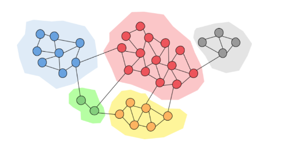

## **7**. Comunità nelle reti

Le comunità sono una proprietà di tante reti reali: una comunità all'interno di una rete contiene dei nodi densamente connessi. I link tra nodi in comunità differenti sono poco frequenti. 



### 7.1 Introduzione

Possiamo pensare ai collegamenti tra nodi come un concetto di amicizia. Granovetter (1973) individuò due diverse prospettive di di amicizia:

* Amicizia strutturale: l'amicizia si distribuisce in diverse parti della rete 
* Amicizia interpersonale: l'amicizia tra due persone può essere forte o debole

Un ruolo fondamentale è quello delle *chiusure triadiche*: se due persone in una rete hanno un amico in comune, allora c'è una più alta probabilità che questi diventino amici. 

Spieghiamo il concetto di amicizia forte e debole:

* Gli archi all'interno di una struttura (es. una chiusura triadica) sono socialmente forti
* Gli archi lunghi che connettono diverse parti della rete sono socialmente deboli 

Inoltre, focalizzandoci sull'informazione che naviga nella rete, possiamo dire che:

* Gli archi lunghi consentono di ottenere informazioni da parti diverse di una rete
* Gli archi all'interno di una struttura sono ridondanti in termini di accesso all'informazione

Osservazione: la perdita di una connessione forte non fa perdere informazione all'interno di una rete, al contrario, la perdita di una connessione debole causa perdita di informazione. 

Osservazione: una chiusura triadica ha un alto coefficiente di clustering. Se $B$ e $C$ hanno un amico $A$ in comune, allora: 

* $B$ verosimilmente incontrerà $C$ ($A$ spende tempo con entrambi)
* $B$ e $C$ credono l'uno nell'altro poiché hanno un amico in comune
* $A$ è incentivato a legare $B$ e $C$

> Esempio: uno studio empirico di Bearman e Moody dimostra che le ragazze teenager con basso coefficiente di clustering sono più inclini al suicidio. 


#### 7.1.1 Arco ponte e ponte locale 

Si definisce **arco ponte** un arco che, se rimosso, trasforma il grafo in un grafo *disconnesso*. Nell'esempio sottostante, l'arco tra $a$ e $b$ è un arco ponte.


Sia $x$ un arco tra i nodi $a$ e $b$, definiamo lo **span** di $x$ come la distanza tra $a$ e $b$ (endpoints dell'arco) nel caso in cui l'arco $x$ venga rimosso dal grafo. Definiamo inoltre **ponte locale** un arco con $span > 2$. Nell'esempio, l'arco tra $a$ e $b$ è un ponte locale poiché, se venisse rimosso, allora la distanza tra $a$ e $b$ sarebbe 3 ($span > 2$). 


Possiamo osservare che la presenza di un ponte locale tra $a$ e $b$ ci informa implicitamente che non esiste un nodo $c$ in comune tra $a$ e $b$. Se esistesse $c$, allora rimosso l'arco, la distanza tra $a$ e $b$ sarebbe pari a 2 ($a \to c, c \to b$). 

Se $a$ è connesso ai nodi $c$ e $d$, e questi ultimi sono connessi tra loro, allora parliamo di archi **forti**. In generale due archi forti implicano un terzo arco, ovvero esiste una *chiusura triadica forte*. Se non vale questa condizione, allora l'arco sarà detto **debole**. 


Se un nodo $a$ soddisfa una chiusura triadica forte ed è coinvolto in almeno due connessioni forti, allora un qualsiasi ponte locale adiacente ad $a$ deve essere una connessione debole. 

Dimostriamolo (per assurdo): supponiamo che $a$ soddisfi una chiusura triadica forte ed abbia due connessioni forti. Sia $a\leftrightarrow b$ un ponte locale ed allo stesso tempo una connessione forte. Allora $b \leftrightarrow c$ deve esistere per la presenza della chiusura triadica forte. Ciò implica che $a \leftrightarrow b$ non è un ponte locale ($span = 2$), ovvero l'assurdo.


#### 7.1.2 Neighborhood overlapping

Siano $v_i$ e $v_j$ due nodi collegati da un arco $x$. Definiamo **overlap** dell'arco $x$ la quantità
$$
O_{ij} = \frac{N(v_i) \cap N(v_j)}{N(v_i) \cup N(v_j)}
$$
Dove $N(v_i)$ indica l'insieme dei vicini del nodo $v_i$. Quindi l'overlapping è definito come la percentuale di vicini in comune tra i due nodi collegati dall'arco. 


Osserviamo che quando $x$ è un ponte locale l'overlap è pari a 0, poiché non vi è nessun nodo in comune tra i due endpoint. È possibile gestire la disconnessione di un grafo basandosi sull'overlap degli archi da rimuovere: rimuovendo archi con un basso overlap, il grafo si disconnetterà prima (poiché sono connessioni poco ridondanti).  


#### 7.1.3 La teoria di Granovetter

La teoria di Granovetter suggerisce che le reti sono composte da insiemi molto connessi tra loro, chiamati **comunità** (cluster, gruppi, moduli). Una comunità è un insieme di nodi con tante connessioni all'interno e poche connessioni all'esterno (con il resto della rete). 


### 7.2 Community Detection

Siamo interessati a identificare le comunità all'interno di una rete. Vedremo alcuni importanti algoritmi che lavorano sui grafi non diretti e non pesati proprio a questo scopo. Molti di questi fanno utilizzo del concetto di **edge betweenness**, ovvero il numero di *cammini minimi* che passano da un arco. 


#### 7.2.1 Algoritmo di Girvan-Newman

L'algoritmo di Girvan-Newman è un algoritmo di clustering gerarchico, basato sulla nozione di edge betweenness. L'algoritmo è pensato per archi non diretti e non pesati e consiste nell'iterare le seguenti due procedure sino a che non vi siano più archi: 

* Si calcola la betweenness degli archi
* Si rimuove l'arco con più alta betweenness 

L'algoritmo restituisce una decomposizione gerarchica della rete (dendogramma). Ad ogni step, le componenti connesse rappresentano le community. In seguito risponderemo alle seguenti due domande: 

* Come calcolare la betweenness?
* Quante comunità vogliamo ottenere?


#### 7.2.2 Calcolo della betweenness

In grafi non pesati e non direzionati, la ricerca di un cammino minimo avviene attraverso una semplice ricerca in ampiezza (BFS, *breadth first search*). Nel grafo di esempio è stata effettuata una ricerca in ampiezza partendo dal nodo $A$: 


Contiamo per ogni nodo $X$ il numero di cammini minimi che vanno da $A$ ad $X$. Tale procedura è facilmente attuabile durante la BFS. Nell'esempio, vi sono due cammini minimi che portano ad $A$ ad $F$, uno passante per $B$ e l'altro passante per $C$. Per cui inseriamo il valore 2 su $F$. Calcoliamo questo valore su ogni nodo del grafo. 


Utilizziamo questo albero per il calcolo della betweenness e illustriamo una tecnica bottom up. Supponiamo di dare un valore di flusso pari ad 1 a tutti i nodi. Partiamo dal nodo $K$ che ha 6 cammini minimi (da $A$). Il nodo $K$ è collegato ad $I$ che ha 3 cammini minimi, e a $J$ che ha 3 cammini minimi. Quindi i nodi hanno rispettivamente $\frac 1 2$ ed $\frac 1 2$ dei cammini minimi di $K$. In base a questi rapporti viene diviso il flusso di $K$ ai nodi soprastanti. 

Il nodo $J$ avrà a disposizione un valore di flusso pari a $1 + \frac 1 2 = 1.5$ (1 dalla partenza, $\frac 1 2$ da $K$). $J$ ha 3 cammini minimi ed è collegato a $G$, che ha 1 cammino minimo, e a $H$, che ha 2 cammini minimi. Quindi i nodi hanno rispettivamente $\frac 1 3$ e $\frac 2 3$ dei cammini minimi di $J$. Ancora una volta dividiamo il flusso in base a questi rapporti, trasferendo $1.5 \cdot \frac 1 3 = 0.5$ a $G$ e $1.5 \cdot \frac 2 3 = 1$ ad $H$. 


Alla fine di questa procedura, su ogni arco sarà passato un certo flusso. Questo valore viene conservato. Si ripete il processo eseguendo delle BFS su ogni nodo del grafo e per ogni BFS si sommano i valori di flusso agli archi. Alla fine dell'algoritmo si otterranno i valori di flusso per ogni nodo, che corrisponderanno alla betweenness. 


#### 7.2.3 Modularità

La modularità $Q$ è una misura di come la rete è ben partizionata in comunità. Attraverso questa misura è possibile individuare il miglior partizionamento nel dendogramma risultante dall'algoritmo di Girvan-Newman, che rispetti la definizione di comunità, ovvero sottogruppi di nodi densamente connessi. Più è alta la modularità, maggiora sarà la qualità del partizionamento della rete in comunità.

Data una partizione $S = \{s_1, \dots, s_k\}$ della rete in $k$ comunità, la la modularità $Q$ è tale che
$$
Q \propto \sum_{s \in S} \Big[
\text{(#archi osservati in s}) - (\text{#archi attesi in s)}
\Big]
$$


##### Modello nullo

Per sapere qual è il numero atteso di archi all'interno di una comunità, è necessario prendere come riferimento un **modello nullo**. Un buon modello nullo è il **configuration model**, che mantiene la stessa distribuzione dei gradi, ma connette i nodi in modo casuale. Quindi se un nodo $x$ ha grado $k$ nel grafo reale, avrà comunque grado $k$ nel modello nullo, ma non sarà necessariamente collegato agli stessi nodi. 

Data una rete reale $G$ con $n$ nodi ed $m$ archi, si costruisce una rete random $G'$. $G'$ è un multigrafo: dato che i nodi si collegano in maniera casuale, allora esisterà la possibilità di collegare più volte la stessa coppia di nodi. 

Se il grafo ha $m$ archi, allora possiamo individuare $2m$ stubs, per immaginare cosa si intende per stub, basti tranciare la parte centrale dell'arco e dividerlo in due. Un nodo con grado $k$ avrà $k$ stub. Siano $i$ e $j$ due nodi, rispettivamente di grado $k_i$ e $k_j$, ad una certa iterazione dell'algoritmo di costruzione del configuration model, uno stab sul nodo $i$ si collega con uno stub del nodo $j$ con probabilità
$$
\frac{k_j}{2m}
$$
Dato che $i$ ha $k_i$ stub, il numero atteso di archi tra $i$ e $j$ è
$$
\frac{k_i \cdot k_j}{2m}
$$
Sommariamente, il numero atteso di archi in un multigrafo $G'$ è
$$
\frac{1}{2} \sum_{i \in N} \sum_{j \in N} \frac{k_ik_j}{2m} =
\frac{1}{2} \frac{1}{2m} \sum_{i \in N} k_i \left(\sum_{j \in N} k_j \right) = \\
= \frac{1}{4m} 2m \cdot 2m = m
$$
Notando che $\sum_{u \in N} k_u = 2m$. 


##### Formalizzare la modularità

Una volta costruito il modello nullo, è possibile calcolare il numero atteso di archi tra due nodi. Quindi scriviamo che: 
$$
Q(G,S) = \frac{1}{2m} \sum_{s \in S} \sum_{i \in S} \sum_{j \in S} \left(
	A_{ij} - \frac{k_ik_j}{2m}
\right)
$$
Dove $A$ è la matrice di adiacenza ed il fattore $\frac{1}{2m}$ normalizza la modularità tra $[-1,1]$. Empiricamente si osserva che una modularità compresa nell'intervallo $[0.3, 0.7]$ indica una significativa community structure. 


#### 7.2.4 Ottimizzare la modularità

Il calcolo della betweenness è molto dispendioso, si potrebbe pensare utilizzare un algoritmo di ottimizzazione ed ottimizzare direttamente la modularità. Si dimostra che l'ottimizzazione della modularità è un problema NP-hard.

Consideriamo un sottoproblema nell'individuazione delle comunità: supponiamo di dividere la rete in due sole comunità, etichettate con -1 ed 1, e voler trovare il partizionamento che massimizzi la modularità. Definiamo un vettore $s$ detto **vettore di appartenenza** tale che: 
$$
s_i = \begin{cases}
1 \text{ se il nodo i è nella comunità 1} \\
-1 \text{ se il nodo i è nella comunità -1}
\end{cases}
$$
Riscriviamo la formula della modularità come segue: 
$$
Q(G, s) = \frac{1}{2m} \sum_{i \in N} \sum_{j \in N} \left(
A_{ij} - \frac{k_ik_j}{2m}
\right) \frac{(s_is_j + 1)}{2}
$$
In tale formula abbiamo rimosso la prima sommatoria ed aggiunto il termine $\frac{(s_is_j + 1)}{2}$. La formula ha la stessa valenza poiché, essendovi solo due comunità, quando si analizzeranno due nodi di comunità differenti il termine $\frac{(s_is_j + 1)}{2} = 0$, quindi il loro contributo non sarà sommato nel calcolo. 

Possiamo semplificare l'espressione come segue: 
$$
Q(G, s) = \frac{1}{4m} \sum_{i \in N} \sum_{j \in N} \left(
	A_{ij} - \frac{k_ik_j}{2m}
\right) s_is_j
$$
Dove il +1 all'interno di $\frac{(s_is_j + 1)}{2}$ genera un'altra sommatoria 
$$
\sum_{i \in N} \sum_{j \in N} \left(
	A_{ij} - \frac{k_ik_j}{2m}
\right) = 0
$$
Poiché il configuration model ha lo stesso numero di archi della rete presa in considerazione, per cui possiamo ometterlo dall'espressione (9). 

Definiamo la matrice di modularità $B$ come 
$$
B_{ij} = A_{ij} - \frac{k_ik_j}{2m}
$$
 Allora possiamo riscrivere il calcolo della modularità $Q$ in forma vettoriale: 
$$
Q(G, s) = \frac{1}{4m} \sum_{i \in N} \sum_{j \in N} B_{ij} s_is_j = \\
= \frac{1}{4m} \sum_{i \in N} s_i\left(\sum_{j \in N} B_{ij} s_j\right)=\\
= \frac{1}{4m} s^T B s
$$
Quindi
$$
Q(G, s) = \frac{1}{4m} \left( s^T \cdot B \cdot s \right)
$$
Vogliamo trovare un vettore di appartenenza $s^*$ che massimizzi la modularità, ovvero quel partizionamento che divida il grafo $G$ in **due** forti comunità. 


##### Teorema dell'autodecomposizione

Sia $A$ una matrice simmetrica e semidefinita positiva, consideriamo le autocoppie, quindi le coppie $\lambda$ (autovalore) ed $x$ (autovettore) soluzioni dell'equazione $Ax = \lambda x$. Si ordinino le autocoppie in maniera decrescente rispetto al proprio autovalore. Gli autovettori sono tutti ortonormali e formeranno un sistema di coordinate. Se $A$ è semidefinita positiva, tutti gli autovalori $\lambda$ sono positivi. Dopo tali ipotesi ed osservazioni, il teorema dell'autodecomposizione asserisce che è possibile scomporre $A$ in termini dei suoi autovettori ed autovalori: 
$$
A = \sum_i x_i \lambda_i x_i^T
$$


##### Utilizzo del teorema 

La matrice $B$ è simmetrica poiché trattiamo un grafo non orientato. Riscriviamo la matrice $B$ nel calcolo della modularità in termini dei suoi autovalori ed autovettori utilizzando il teorema precedente: 
$$
B = \sum_{i=1}^n x_i\lambda_ix_i^T
$$
Quindi 
$$
Q(G, s) = \frac{1}{4m} \left[ s^T \cdot 
\left( \sum_{i=1}^n x_i\lambda_ix_i^T \right)
\cdot s \right] = \\

= \frac{1}{4m} \left( 
\sum_{i=1}^n s^T x_i\lambda_ix_i^T s \right) = \\

= \frac{1}{4m} \sum_{i=1}^n (s^T x_i)^2\lambda_i \\
$$
Se non ci sono ulteriori vincoli sul vettore $s$, allora per massimizzare $Q$ bisogna porre $s = x_n$, ovvero l'autovettore principale. Essendo che tutti gli autovettori sono ortonormali tra loro, allora il prodotto tra $s = x_n$ e $x_i$ sarà nullo, per cui nella massimizzazione possiamo rimuovere la sommatoria e considerare solo l'autovettore principale: 
$$
\sum_{i=1}^n (s^T x_i)^2\lambda_i \approx (s^T x_n)^2\lambda_n 
$$
Quindi infine, anziché massimizzare direttamente la modularità, massimizziamo: 
$$
s^* = \max_{s} (s^T x_n)
$$
Dove rimuoviamo: il quadrato, l'autovalore $\lambda_n$ e il fattore normalizzante $\frac 1 {4m}$ poiché non veicolano la massimizzazione della modularità. 

Notiamo che se $s = x_n$ allora avrà valori diversi da $\{-1, 1\}$. Per inserire i nodi nella giusta partizione settiamo: 
$$
s_j = \begin{cases}
+1 \text { se } x_{n,j} \ge 0 \\
-1 \text { se } x_{n,j} < 0
\end{cases}
$$
Dopodiché è possibile continuare la bisezione in maniera gerarchica. 


#### 7.2.5 Algoritmo veloce per l'ottimizzazione della modularità

Un algoritmo veloce per ottimizzare la modularità è il seguente: 

* Si trova l'autovettore principale $x_n$ della matrice di modularità $B$
  * Ad esempio utilizzando il power method. 
* Si dividono i nodi in base al segno degli elementi di $x_n$ 
* Si ripete gerarchicamente sino a che
  * Lo split causa un incremento della modularità e si restituisce un solo cluster 
  * Tutte le comunità non sono più divisibili


### 7.3 Spectral clustering 


##### 7.3.1 Graph partitioning 

Sia $G(V, E)$ un grafo non direzionato. Effettuare un bi-partizionamento (*bi-partitioning task*) consiste nel dividere i vertici del grafo in due gruppi disgiunti $A$ e $B$. Come definiamo una buona partizione di $G$? Come possiamo trovare tale partizione in maniera efficiente?

Ma prima di tutto, cosa rende buona una partizione? Idealmente vorremmo massimizzare il numero di connessioni whitin-group (dentro il gruppo) e minimizzare il numero di connessioni between-group (tra gruppi distinti). 


#### 7.3.2 Graph cut 

Partizioniamo $G(V, E)$ in due gruppi $A$ e $B$. Definiamo **cut** l'insieme di archi con un vertice in $A$ e l'altro in $B$
$$
cut(A,B) = \sum_{i \in A, j \in B} A_{ij}
$$
Nell'esempio sottostante si ha $cut(A,B) = 2$: 


#### 7.3.3 Minimum cut

Un criterio per ottenere un buon partizionamento del grafo è quello di minimizzare il cut, quindi scegliere $A,B$ come: 
$$
A,B = arg\min_{A,B}\left[ cut(A,B) \right]
$$
Tuttavia abbiamo dei casi limite che tale criterio non riesce ad evitare: 


Ciò avviene poiché il minimum cut considera solo le connessioni esterne al gruppo e non la connettività tra i nodi interni al gruppo. 


#### 7.3.4 Normalized cut

Il normalize cut (Shi-Malik, '97) risolve il drawback del minimum cut andando ad introdurre il concetto di volume. Il volume $vol(A)$ di un gruppo $A$ è la somma dei pesi (se il grafo è pesato) degli archi con almeno un endpoint in $A$, quindi 
$$
vol(A) = \sum_{i \in A} k_i
$$
Il normalized cut è definito come segue: 
$$
ncut(A,B) = \frac{cut(A,B)}{vol(A)} + \frac{cut(A,B)}{vol(B)}
$$
Tale criterio produce partizioni bilanciate, tuttavia trovare il taglio ottimale è un problema NP-hard, per cui non si andrà a trovare la soluzione esatta, bensì una soluzione approssimata ma certamente più efficiente. 


#### 7.3.5 Spectral Graph Partitioning 

Sia $A$ la matrice di adiacenza del grafo $G$ non direzionato (quindi $A_{ij} = 1$ se $(i,j) \in E$). Sia $x$ un vettore in $\R^n$ con $(x_1, \dots, x_n)$ componenti (pensiamolo come etichette/valori di ogni nodo in $G$). 

Eseguendo il prodotto riga-colonna tra $A$ ed $x$ otterremo un vettore $y$ in cui l'$i$-esima componente non è altro che la somma di tutte le etichette $x_j$ dei vicini di $i$. 
$$
\begin{bmatrix}
a_{11} & \dots & a_{1n} \\
\vdots & \ddots & \vdots \\
a_{n1} & \dots & a_{nn} \\
\end{bmatrix}

\begin{bmatrix}
x_{1} \\
\vdots\\
x_{n} \\
\end{bmatrix}

= 

\begin{bmatrix}
y_{1} \\
\vdots\\
y_{n} \\
\end{bmatrix}
$$
Quindi 
$$
y_i = \sum_{j=1}^n A_{ij} x_j = \sum_{(i,j) \in E} x_j
$$
La spectral graph teory non fa altro che analizzare lo spettro della matrice che rappresenta il grafo $G$. Per **spettro** si intendono gli autovettori $x_i$ del grafo, ordinati per la magnitudo (forza) dei corrispondenti autovalori $\lambda_i$: 
$$
\Lambda = \{\lambda_1, \lambda_2, \dots, \lambda_n\} \\
\lambda_1 \le \lambda_2 \le \dots \le \lambda_n\
$$


##### D-regular graph 

Supponiamo che $G$ sia un grafo d-regolare, ovvero che tutti i nodi di $G$ abbiano grado $d$. Inoltre supponiamo che $G$ sia connesso. Quali sono gli autovalori ed autovettori di $G$?

Inizializziamo tutte le componenti di $x$ ad 1 ed osserviamo: 
$$
\begin{bmatrix}
a_{11} & \dots & a_{1n} \\
\vdots & \ddots & \vdots \\
a_{n1} & \dots & a_{nn} \\
\end{bmatrix}

\begin{bmatrix}
1 \\
\vdots\\
1 \\
\end{bmatrix}

= 

\begin{bmatrix}
d \\
\vdots\\
d \\
\end{bmatrix}
$$
Se ogni nodo ha $d$ vicini e le etichette valgono tutte 1, allora le componenti del vettore $y$ risultante saranno tutte pari a $d$ (poiché l'$i$-esima componente non è altro che la somma di tutte le etichette $x_j$ dei vicini di $i$.). Questo vuol dire che: 
$$
A \cdot x = (d, d, \dots, d) = \lambda \cdot x 
$$
Dove $\lambda = d$, quindi la coppia $x = (1,1,\dots, 1)$ e $\lambda=d$ è una autocoppia. 


##### D-regular graph con due componenti

Se $G$ è disconnesso ed ha 2 componenti, ognuna $d$-regolare, allora succede che le righe della matrice di adiacenza assumeranno due forme differenti: 

* Se $i$ appartiene alla componente $A$, avrà 1 in $d$ nodi interni a $A$ e 0 nei rimanenti
  * $x' = (1, \dots, 1, 0, \dots, 0)$ quindi $A \cdot x' = (d, \dots, d, 0, \dots,0)$
* Se $i$ appartiene alla componente $B$, avrà 1 in $d$ nodi interni a $B$ e 0 nei rimanenti
  * $x'' = (0, \dots, 0, 1, \dots, 1)$ quindi $A \cdot x'' = (0, \dots, 0, d, \dots,d)$

In entrambi i casi si ha che $\lambda = d$. L'intuizione è la seguente: se con due componenti separate i due autovalori sono uguali, allora se esiste qualche arco tra le due componenti, gli autovalori resteranno pressoché uguali. 


Inoltre gli autovettori sono ortogonali tra loro, quindi $x_n \cdot x_{n-1} = 0$. In un grafo $d$-regolare, il primo autovettore $x_n$ sarà $[1, \dots, 1]$. Essendo che il prodotto scalare è nullo, allora sicuramente il secondo vettore dovrà contenere **anche** dei valori negativi.  

L'intuizione alla base dello spectral clustering consiste nel prendere il secondo autovettore $x_{n-1}$ e suddividere i nodi in base al segno: tutti i nodi la cui rispettiva componente è non negativa andranno nel gruppo $A$, tutti gli altri andranno nel gruppo $B$. 


##### Matrice laplaciana 

Sia $A$ una matrice di adiancenza del grafo $G$, di dimensione $n \times n$. Sotto ipotesi di grafo non direzionato, la matrice di adiacenza è simmetrica, con autovettori reali ed ortogonali. 


Sia $D$ la degree matrix del grafo $G$, ovvero una matrice *diagonale* di dimensione $n \times n$ in cui l'elemento $D_{ii} = k_i$. 


Definiamo la matrice laplaciana $L$ del grafo $G$ come una matrice simmetrica di dimensione $n \times n$ definita come $L = D-A$. 


Una autocoppia banale della matrice $L$ è data dall'autovettore $(1, \dots, 1)$ e dall'autovalore $\lambda = 0$, questo poichè la moltiplicazione riga colonna con un vettore $(1,\dots,1)$ corrisponde a sommare gli elementi della riga e, possiamo osservare, che la somma di ogni riga nella matrice laplaciana è 0. La matrice Laplaciana gode delle seguenti proprietà: 

* (a) Ha autovalori reali non negativi 
* Ha autovettori reali ed ortogonali
* (b) $x^T \cdot L \cdot x \ge 0$ per ogni autovettore $x$
* (c) È semidefinita positiva ($\exist N : L = N^T \cdot N$)
  * Direzionando casualmente $G$, possiamo porre $N = I(G)$ ovvero la sua matrice di incidenza. 

> Alcune dimostrazioni: 
>
> * $(c) \Rightarrow (b): x^TLx = x^TN^TNx = (xN)^T (Nx) \ge 0$ (moltiplicazione del vettore per se stesso è $> 0$)
> * $(b) \Rightarrow (a):$ sia $\lambda$ un autovalore di $L$, dalla $(b)$  ne segue che $x^TLx \ge 0$ quindi (dato che $x$ è autovettore) $x^TLx = x^T\lambda x = \lambda x^T x \Rightarrow \lambda > 0$ (nota che $x^T x = 1$ poiché $x$ è unitario). 


#### 7.3.6 Autocoppia di Fiedler

Diamo per assunto che per una generica matrice simmetrica $M$ valga la seguente proprietà: 
$$
\lambda_2 = \min_{x}\frac{x^TMx}{x^Tx}
$$
L'autovalore $\lambda_2$ viene chiamato **autovalore di Fiedler** ed il suo corrispettivo autovettore prende il nome di **vettore di Fiedler**. 

Dato che la matrice laplaciana $L$ è una matrice simmetrica, possiamo scrivere che: 
$$
\lambda_2 = \min_{x}\frac{x^TLx}{x^Tx}
$$
Focalizziamoci sul prodotto al numeratore: 
$$
x^TLx = \sum_{i=1}^n \sum_{j=1}^n L_{ij} x_i x_j
$$
Adesso scomponiamo la matrice laplaciana 
$$
\sum_{i=1}^n \sum_{j=1}^n L_{ij} x_i x_j = 
\sum_{i=1}^n \sum_{j=1}^n (D_{ij} - A_{ij}) x_i x_j = 
\sum_{i=1}^n \sum_{j=1}^n x_i x_jD_{ij} - x_i x_jA_{ij}
$$
Dato che per $D$ è una matrice diagonale, allora tutti i valori al di fuori della diagonale varranno 0. Inoltre la matrice di adiacenza ha valori diversi da 0 solo se esiste un arco tra i due nodi, quindi riscriviamo l'espressione come segue: 
$$
\sum_{i=1}^n D_{ii}x_i^2 - 
\sum_{(i,j) \in E}  2x_i x_j
$$
Essendo un grafo non direzionato considereremo al secondo membro lo stesso arco 2 volte. Osserviamo che, per ogni arco presente nel grafo, saranno presenti $x_i^2$ ed $x_j^2$ dal primo membro, e $2x_ix_j$ al secondo membro. Questo sembra essere proprio un quadrato di binomio, quindi riscriviamo: 
$$
\sum_{(i,j) \in E} (x_i^2 + x_j^2 - 2x_ix_j) = 
\sum_{(i,j) \in E} (x_i - x_j)^2
$$
Imponiamo dei vincoli sul vettore $x$: 

* (a) $x$ sarà un vettore unitario $\sum_i x_i^2 = 1$
* (b) $x$ sarà ortogonale al primo autovettore $(1, \dots, 1)$ 
  * Quindi $\sum_i x_i \cdot 1 = \sum_i x_i = 0$ 
  * Ovvero vi saranno sia componenti positive che negative

Quindi scriviamo 
$$
\lambda_2 = \min_{x} \frac{\sum_{(i,j) \in E} (x_i - x_j)^2}{\sum_i x_i^2} = 
\min_{x} \sum_{(i,j) \in E} (x_i - x_j)^2
$$
Tenendo conto dei vincoli imposti (essendo il denominatore pari ad 1 è possibile rimuoverlo dalla minimizzazione). Nella pratica vogliamo assegnar nel vettore $x$ dei valori positivi ai nodi di un gruppo e dei valori negativi ai nodi dell'altro gruppo **tale che** vi siano pochi archi che attraversino lo 0. 


Ritornando al taglio ottimale, esprimiamo $(A,B)$ come un vettore $y$ tale che
$$
y_i = \begin{cases}
+1 \text{ se } i \in A \\
-1 \text{ se } i \in B
\end{cases}
$$
Per ottenere una partizione $y$ (sub)ottimale si minimizza l'espressione 
$$
y = arg\min_y \sum_{(i,j) \in E} (y_i - y_j)^2
$$
Tuttavia non è possibile risolvere tale equazione in modo esatto, per cui si rilassa $y$ ammettendo valori reali (e non solo -1 ed 1). 


##### Teorema di Rayleigh

Il teorema di Rayleigh enuncia che, per il seguente problema di minimizzazione: 
$$
\min_{y \in \R^n} f(y) = \sum_{(i,j) \in E} (y_i - y_j)^2 = y^TLy
$$
Vale che

* $\lambda_2 = \min f(y)$, ovvero il minimo di $f(y)$ è dato dal secondo più piccolo autovalore $\lambda_2$ del laplaciano $L$. 
* $x = arg\min_y f(y)$, ovvero la soluzione ottimale per $y$ è data dal corrispondente autovettore $x$, chiamato **vettore di Fiedler**. 


##### Approssimazione garantita

Ricordiamo che: se un grafo $G(V,E)$ ha una **espansione** $\alpha$, allora è garantito che comunque preso un sottoinsieme di nodi $S \subseteq V$ il numero di archi uscenti da $S$ è maggiore o uguale a $\alpha \min(|S|, |V \setminus S|)$. 

Supponiamo di avere una partizione in $G$ in $A$ e $B$ dove $|A| \le |B|$, possiamo porre l'espansione $\alpha$ pari a: 
$$
\alpha = \frac{\text{#archi da A a B}}{|A|}
$$
allora possiamo garantire che l'autovalore di Fiedler $\lambda_2 \le 2\alpha$. L'espansione corrisponde al taglio ottimale applicabile ad un grafo. Tale approssimazione ci dice che ciò che troviamo con lo spectral clustering è al più  due volte peggiore dello score ottimale $\alpha$. 

**Dimostrazione**

Sia $a = |A|$ e $b = |B|$, con $e = \text{#archi da A a B}$. Possiamo scegliere $x$ basato su $A$ e $B$ tale che: 
$$
\lambda_2 \le \frac{\sum_{(i,j) \in E}(x_i - x_j)^2}{\sum_j x_j^2} \le 2\alpha
$$
Impostiamo
$$
x_i = \begin{cases}
-\frac 1 a \text{ se } i \in A \\
+\frac 1 b \text{ se } i \in B \\
\end{cases}
$$
Ovviamente la somma di tutte le componenti di $x$ è pari a zero, poichè avremo $a$ volte $-\frac 1 a$ e $b$ volte $+\frac 1 b$, quindi
$$
a (-\frac{1}{a}) + b(\frac{1}{b}) = 0
$$
e viene rispettato il vincolo di ortogonalità tra $x$ ed il primo autovettore $(1, \dots, 1)$. Riscriviamo: 
$$
\frac{\sum_{(i,j) \in E}(x_i - x_j)^2}{\sum_j x_j^2} = 
\frac{\sum_{i \in A, j \in B \\ (i,j) \in E} (-\frac 1 a + \frac 1 b)^2}{a (-\frac{1}{a})^2 + b(\frac{1}{b})^2} = 
\frac{e (-\frac 1 a + \frac 1 b)^2}{\frac 1 a + \frac 1 b} = 
e \left(-\frac 1 a + \frac 1 b\right)
$$
E da qui costruiamo la disequazione
$$
e \left(-\frac 1 a + \frac 1 b \right) \le 
e \left(\frac 1 a + \frac 1 b \right) \le 
e \left(\frac 1 a + \frac 1 a \right) = 
e \left(\frac 2 a \right) = \\
= 2 \frac{e}{a} =
2\frac{\text{#archi da A a B}}{|A|} =
2 \alpha
$$
Per transitività abbiamo che $\lambda_2 \le 2 \alpha$. 

> Un lower bound per $\lambda_2$ (dato per buono) è che $\lambda_2 \ge \frac{\alpha^2}{2k_{max}}$, dove $k_{max}$ è il grado massimo nel grafo. 

#### 7.3.7 Spiegazione semplice

Sia $G$ un grafo non direzionato e non pesato con $n$ nodi, sia $A$ la sua matrice di adiacenza. Essendo un grafo indiretto, $A$ sarà simmetrica. Definiamo $A$:
$$
A_{ij} = \begin{cases}
1 \text{ se } (i,j) \in E \\
0 \text{ altrimenti}
\end{cases}
$$
Sia $D$ la matrice dei gradi di $G$, ovvero una matrice diagonale definita come segue: 
$$
D_{ij} = \begin{cases}
k_i \text{ se } i =j \\
0 \text{ altrimenti}
\end{cases}
$$
Definiamo adesso la matrice laplaciana $L$ del grafo $G$ dalla differenza $L=D-A$, ovvero:
$$
L_{ij} = \begin{cases}
k_i \text{ se } i = j \\
- 1 \text{ se } (i,j) \in E \\
0 \text{ altrimenti}
\end{cases}
$$
La matrice laplaciana è semidefinita positiva ed ha autovalori reali non negativi. Siano $\{\lambda_1, \lambda_2, \dots, \lambda_n\}$ gli autovalori di $L$, ordinati in maniera crescente $\lambda_1 \le \lambda_2 \le \dots \le \lambda_n$, e siano $x_1,x_2, \dots, x_n$ i rispettivi autovettori. Gli autovalori rivelano proprietà del grafo non osservabili dalla matrice di adiacenza:

* (a) Se $\lambda_1 = \lambda_2 = \dots, \lambda_k = 0$, allora il grafo ha $k$ componenti connesse. 
* (b) Se il grafo è connesso, allora $\lambda_2 > 0$ ed è chiamato autovalore di Fiedler. 
  * (c) $\lambda_1 = 0$ e $x_1 = (1, \dots, 1)$ perché la somma delle righe di $L$ risulta 0.  

Più alto è l'autovalore di Fiedler, più il grafo è densamente connesso. Nella pratica si prende l'autovettore $x_2$ corrispondente all'autovalore di Fiedler, chiamato vettore di Fiedler e si effettua un bipartizionamento come segue: 
$$
A = \{ u \mid x_2(u) \ge 0 \} \\
B = \{ v \mid x_2(v) < 0 \}
$$
Per l'osservazione $b$, più piccolo è $\lambda_2$, migliore è il bipartizionamento. Sia $f$ la funzione definita come segue:
$$
f(x) = \frac{x^TLx}{x^Tx} = \sum_{(i,j) \in E} (x_i - x_j)^2
$$
Per il teorema di Rayleigh sappiamo che $\lambda_2 = \min_x f(x)$ e $x_2 = \text{arg}\min_x f(x)$. Inoltre, sia $\alpha$ l'espansone del grafo $G$, si può dimostrare che $\lambda_2 \le 2\alpha$.  


#### 7.3.8 Procedura

Nella pratica, lo spectral clustering consiste in tre fasi: 

* il **preprocessing**, dove si calcola la matrice Laplaciana $L$
* la **decomposizione**, dove si identificano le autocoppie di $L$. 
* Il **grouping** dove si mappano i nodi nei due gruppi in base alle componenti dell'autovettore corrispettivo all'autovalore $\lambda_2$ (es. valori negativi in $A$ e valori positivi in $B$). 


#### 7.3.8 K-way Spectral clustering

Possiamo partizionare il grafo in $k$ cluster utilizzando varie tecniche, le più utilizzate sono: 

* **Recursive bi-partitioning**: Si applica ricorsivamente la bipartizione e si suddividono i cluster in  modo gerarchico (inefficiente, instabile).
* **Cluster multiple eigenvector**: Si costruisce uno spazio ridotto utilizzando gli autovettori e si effettua il clustering per identificare le comunità. 

Usare diversi autovettori aiuta ad approssimare il cut ottimale, sottolinea cluster coesivi e divide i nodi in uno spazio ben separato. 


### 7.4 Sweep 

L'algoritmo Sweep utilizza il PageRank per identificare dei cluster densi. Il grafo su cui si opera è spesso molto grande, per cui l'utilizzo di algoritmi di ordine maggiore a quello lineare è sconsigliabile. Lo Sweep ha un tempo proporzionale alla dimensione dei cluster (e non a quella del grafo). 


#### 7.4.1 Idea

Prendiamo un nodo *seed* $s$ ed eseguiamo un PageRank personalizzato con teleport set $\{s\}$. Se $s$ appartiene ad un cluster, allora il random surfer resterà con molta probabilità intrappolato all'interno di esso.


#### 7.4.2 Conduttanza

Prima di parlare dell'algoritmo in sé, è necessario introdurre il concetto di **conduttanza**. La conduttanza indica la connettività di un gruppo rispetto al resto della rete, relativa alla densità del gruppo. Ovviamente un buon cluster ha una bassa conduttanza. Sia $S \subseteq V$, la conduttanza è definita come segue: 
$$
\phi(S) = \frac
{\text{#archi da } S \text{ a } (V \setminus S)}
{\min(vol(S), 2m-Vol(S))} = 
\frac{cut(S)}{\min(vol(S), 2m-Vol(S))}
$$
Dove ovviamente $vol(V) = 2m$ e quindi $vol(V \setminus S) = 2m - Vol(S)$, ed $m = |E|$. Utilizzando questo criterio come guida induce a produrre partizionamenti più bilanciati. 


#### 7.4.3 Algoritmo

L'algoritmo è descritto nei seguenti passi: 

* Scegliere un nodo $s$ di interesse
* Eseguire il Personalized-PageRank (PPR) con teleport $\{s\}$
* Ordinare i nodi in modo decrescente rispetto allo score PPR
  * Quindi si produce una sequenza $r_1, r_2, \dots, r_n$

Dopodiché si procede con lo sweep: 

* Si inizializza $A_0 = \empty$  
* Per $t = 1, \dots, n$:
  * $A_t = A_{t-1} \cup \{r_t\}$ 
  * Si calcola la conduttanza per il cluster $\phi(A_t)$

Dato che un buon cluster ha una bassa conduttanza, possiamo considerare come buon cluster il cluster che restituisca un minimo locale di $\phi(A_i)$.  


##### Calcolo in tempo lineare

La curva di Sweep può essere calcolata in tempo lineare: 

* Iteriamo sui nodi
* Manteniamo una tabella hash dei nodi in $A_t$
* Calcoliamo $\phi(A_{t+1}) = \frac{cut(A_{t+1})}{vol(A_{t+1})}$ dove: 
  * $vol(A_{t+1}) = vol(A_{t}) + d_{i+1}$
  * $cut(A_{t+1}) = cut(A_{t}) + d_{i+1} - 2\text{#(archi da $u_{i+1}$ ad $A_t$})$ 


#### 7.4.4 PageRank approssimato

Ipotizziamo di effettuare un pagerank con teletrasporto a partire dal nodo $u$. Sia $q$ un vettore di residui con tutte le componenti nulle tranne la componente $q_u=1$. Supponiamo di voler approssimare il vettore $p$ che contiene i pagerank score con un vettore $r$ inizialmente posto a 0, ammettendo un errore controllato dalla costante $\epsilon$. Definiamo l'azione di push: 

```
 
 	push(u, r, q): 
        r' = r 
        q' = q 

        # prendiamo (1-beta dal residuo) e cediamolo ad r'(u)
        r'(u) = r(u) + (1-beta) * q(u)

        # resta q(u)*beta residuo disponibile
        # di questo ne teniamo solo la metà
        q'(u) = (q(u) * beta) * 0.5

        # cediamo l'altra metà al rank dei vicini N(u) di u 
        for v : (v,u) in E:
        	residuo_rimanente = 0.5 * ( beta * q(u) ) / 
            q'(v) = q(v) + ( residuo_rimanente / |N(u)| )  

        # ritorniamo i vettori aggiornati
        return r', q'
	
```

Possiamo dare per assunto che il residuo sia tale che: 
$$
q_u = p_u - r_u
$$
Quindi se $q_u$ è alto vuol dire che nella approssimazione $r_u$ stiamo sottostimando il reale score $p_u$ del nodo $u$. Come facciamo a sapere se $q_u$ è alto? Possiamo ancora una volta dare per assunto che se si verifica
$$
\frac{q_u}{d_u} \ge \epsilon
$$
allora il residuo è alto. Quando non si verifica più tale condizione per il nodo $u$, allora abbiamo raggiunto una buona approssimazione del suo pagerank score. Quindi definiamo il PageRank approssimato come segue: 

```

	ApproxPageRank(S, beta, eps):
		r = [0, ..., 0]
		q = [0, ..., 1, ..., 0] # asserire il nodo di partenza
		
		while (esiste u : ( q(u) / d(u) >= eps ) : 
			r, q = push(u, r, q)
		
		return r, q
		
```

Questo algoritmo utilizza inoltre il lazy random walk, secondo la quale lo step di aggiornamento è definito come segue: 
$$
r_u^{(t+1)} = \frac 1 2 r_u^{(t)} + 
\frac 1 2 \sum_{i \to u} \frac 1 {d_u} r_i^{(t)}
$$
Ovvero con probabilità del $50$% si sta fermi, con la restante ci si muove. 

Il pagerank approssimato calcola il personalized pagerank in un tempo pari a $\left(\frac{1}{\epsilon(1-\beta)}\right)$, mentre la power iteration richiederebbe un tempo pari a $\left( \frac{\log n}{\epsilon (1 - \beta)} \right)$. Si può dimostrare che se esiste un taglio con conduttanda $\phi$ e volume $k$, allora il metodo trova un taglio di conduttanda $O\left(\sqrt{\frac{\phi}{\log k}}\right)$. 


### 7.5 Motif-Based Clustering

Preso in input un grafo $G$, per ogni tipo di motif (sottografo, graphlet) possibile si vanno a contare le occorrenze del sottofrafo in $G$. 

Focalizziamoci su un motif specifico in $G$ e prendiamo $S \subseteq V$. Definiamo: 

* **Motif cut**: quanti motif hanno endpoint sia in $S$ che fuori da $S$ 
* **Motif volume**: quanti endpoint (stub) dei vari motif cadono in $S$ 
* **Motif conduttanza**: il rapporto tra il motif cut ed il motif volume $\phi_M = \frac{cut_M(S)}{vol_M(S)}$

Ovvero abbiamo ri-definito le metriche precedenti, utilizzando i motif anziché gli archi. 

Considerato un certo motif $M$, l'algoritmo consiste in un primo passo di **preprocessing**, in cui si calcola la matrice $W^{(M)}$, dove l'elemento $(i,j)$ indica il numero di volte in cui l'arco $(i,j)$ partecipa ad una istanza del motif $M$. 


Dopodiché si calcola un **approximated PageRank** utilizzando la matrice pesata $W^{(M)}$ e si procede con lo **sweep** per andare ad individuare i cluster. 


### 7.6 Louvain - Ottimizzazione della modularità 

L'algoritmo di Louvain è un algoritmo di community detection che tenta di ottimizzare la modularità $Q$ con un approccio greedy e con un running time $O(n\log n)$. Questo algoritmo funziona anche con grafi pesati ed è ampiamente utilizzato per grosse reti. 


#### 7.6.1 Riformulare la modularità

Considerando il configuration model come modello nullo, dato un grafo $G$ ed un partizionamento $S$, abbiamo definito la modularità come segue: 
$$
Q(G,S) = \frac{1}{2m} \sum_{s \in S} \sum_{i \in S} \sum_{j \in S} \left(
	A_{ij} - \frac{k_ik_j}{2m}
\right)
$$
Essendo che non si considerano mai archi con endpoint su cluster differenti, possiamo andare a riformulare la modularità utilizzando la funzione Delta di Dirac $\delta$. Supponiamo che $c_i$ indichi il cluster a cui il nodo $i$ è associato, allora:  
$$
\delta(i,j) = \begin{cases}
1 \text{ se } c_i = c_j \\
0 \text{ altrimenti } 
\end{cases}
$$
Quindi riscriviamo la modularità: 
$$
Q(G,S) = \frac{1}{2m} \sum_{i,j \in V} \left(
	A_{ij} - \frac{k_ik_j}{2m} 
\right) \cdot \delta(i,j)
$$


#### 7.6.2 Idea generale

L'algoritmo si divide in due fasi: 

* La **prima fase** consiste nell'esaminare i cluster a coppie e spostare i nodi da un cluster ad un altro se e solo se si ha un incremento della modularità. 
* La **seconda fase** aggrega i cluster in supernodi per costruire una nuova rete. 

Si ritorna quindi alla prima fase, fino a che non si ha un supernodo che rappresenti l'intera rete. 


#### 7.6.3 Prima fase - Partizionamento

All'inizio dell'algoritmo ogni nodo verrà inserito in un cluster distinto. Dopodiché, per ogni nodo $i$ l'algoritmo effettuerà due calcoli: 

* Si calcola la modularità $\Delta Q$ quando si inserisce $i$ nella comunità di un vicino $j$
* Si sposta $i$ nella comunità del nodo $j$ che da il maggiore guadagno $\Delta Q$. 

La fase 1 finisce quando non ci sono movimenti che possano aumentare il guadagno. L'ouput dell'algoritmo dipende dall'ordine in cui i nodi sono processati. La fase finisce con un massimo locale della modularità. 


##### Calcolo della modularità su singolo cluster

A cosa corrisponde $\Delta Q$ quando muoviamo il nodo $i$ nella comunità $C$? Supponiamo di voler muovere il nodo $i$ dalla comunità $D$ alla comunità $C$, quindi vogliamo calcolare 
$$
\Delta Q (D \to i \to C) = \Delta Q(i \to C) + \Delta Q(D \to i)
$$
Dove $\Delta Q(D \to i)$ corrisponde al gain che si ha quando si toglie $i$ da $D$ e si forma una ulteriore comunità formata solamente da $i$, mentre $\Delta Q(i \to C)$ è il gain che si ha spostando $i$ all'interno di $C$. 


Definiamo la modularità $Q(C)$ **per un singolo cluster** $C$ come: 
$$
Q(C) = \frac{1}{2m} \sum_{i,j \in C} A_{ij} - \frac{k_ik_j}{2m}
$$
Definiamo: 
$$
\Sigma_{in} = \sum_{i,j \in C} A_{ij}
$$
Ovvero la somma degli archi (o dei pesi degli archi) tra nodi all'interno del cluster $C$. 

Definiamo: 
$$
\Sigma_{tot} = \sum_{i \in C} k_i 
$$
Ovvero la somma degli archi (o dei pesi degli archi) di ogni nodo nel cluster $C$. 


Riscriviamo $Q(C)$ come segue: 
$$
Q(C) = \frac{1}{2m} \sum_{i,j \in C} A_{ij} - \frac{k_ik_j}{2m} = \\

= \sum_{i,j \in C} \frac{A_{ij}}{2m} - \frac{k_ik_j}{(2m)^2} = \\

= \frac{ \sum_{i,j \in C} A_{ij}}{2m} - 
\frac
{\left( \sum_{i\in C}k_i \right) 
\left(\sum_{j\in C} k_j \right)}{(2m)^2} = \\

=\frac{\Sigma_{in}}{2m} - \left( \frac{\Sigma_{tot}}{2m} \right)^2
$$
Quindi 
$$
Q(C)=\frac{\Sigma_{in}}{2m} - \left( \frac{\Sigma_{tot}}{2m} \right)^2
$$


##### Derivare $\Delta Q (i \to C)$

Abbiamo considerato il nodo $i$, distaccato dal cluster $D$, come un cluster a sé stante. Dobbiamo calcolare $\Delta Q (i \to C)$. Prima di tutto, definiamo le quantità: 

* $k_{i, in}$ che equivale alla somma degli archi (o dei pesi degli archi) tra $i$ ed il cluster $C$.
* $k_i$ che equivale alla somma degli archi (o pesi degli archi) del nodo $i$, ovvero il suo grado. 


Definiamo la modularità $Q_{prima}$ prima del merging di $i$ su $C$: 
$$
Q_{prima} = Q(C) + Q(\{i\}) = 
\left[\frac{\Sigma_{in}}{2m} - \left( \frac{\Sigma_{tot}}{2m} \right)^2\right]
+
\left[0 + \left(\frac{k_i}{2m}\right)^2\right]
$$
 E la modularità $Q_{dopo}$ dopo il merging: 
$$
Q_{dopo} = Q(C \cup \{i\}) =  
\left[\frac{\Sigma_{in} + k_{i,in}}{2m} - \left( \frac{\Sigma_{tot} + k_i}{2m} \right)^2\right]
$$
Allora possiamo dire che 
$$
\Delta Q (i \to C) = Q_{dopo} - Q_{prima}
$$
Con lo stesso principio si calcola $\Delta Q (D \to i)$. 


#### 7.6.4 Seconda fase - Collasso

Tutte le community ottenute nella prima fase sono contratte in super-nodi, e una nuova rete viene creata di conseguenza: 

* I super-nodi sono connessi se esiste almeno un arco che connette le due community
* Il peso dell'arco tra due super-nodi è pari alla somma dei pesi degli archi dei nodi che connettono le community
* I super-nodi hanno dei cappi con peso pari alla somma dei pesi degli archi interni. 

Dopodiché viene ripetuta la prima fase utilizzando la nuova rete. 


### 7.7 Trawling - Analisi di grandi grafi

L'algoritmo Trawling permette di identificare delle piccole comunità all'interno del web. Utilizzando questo algoritmo, è possibile identificare i topic comuni tra le pagine web: pagine che parlano dello stesso topic sono collegate tra loro con alta probabilità. 


#### 7.7.1 Idea 

Supponiamo di disporre in due layer differenti (1, 2) gli stessi nodi di un grafo $G$. Colleghiamo il nodo $u$ dal layer 1 con tutti i suoi vicini nel grafo $G$ sul layer 2. Due nodi $u$ e $v$ che stanno all'interno della stessa comunità, molto probabilmente avranno tanti vicini in comune. 


#### 7.7.2 Definire il problema 

Si vogliono enumerare i sottografi **completi** bipartiti $K_{s,t}$, dove con $s$ indichiamo il numero di nodi a sinistra (layer 1), dove ognuno di essi si collega agli stessi $t$ nodi sulla destra (layer 2). 


#### 7.7.3 Frequent Itemset Enumeration

Utilizziamo le tecniche del Market Basket Analysis (MBA) per risolvere il problema. Definiamo un universo $U$ di $n$ **item**. Definiamo i **basket** come $m$ sottoinsiemi di $U$, $S_1, \dots, S_m \subseteq U$. Definiamo il **supporto** $f$ come un threshold di frequenza. Vogliamo trovare tutti i sottinsiemi $T$ tale che $T \subseteq S_i$ in almeno $f$ insiemi $S_i$, ovvero gli item in $T$ sono stati "acquistati" insieme almeno $f$ volte. 

Colleghiamo il task del MBA al grafo bipartito: se il nodo $i$ ha come vicini i nodi $\{a,b,c\}$, allora definiamo il basket $S_i = \{a,b,c\}$. Il nostro $K_{s,t}$ sarà un insieme $Y$ di cardinalità $t$ che si presenta in $s$ insiemi $S_i$ (ovvero avremo $s$ nodi con gli stessi $t$ vicini). Cercare $K_{s,t}$ vuol dire cercare un insieme con una frequenza minima $s$ e di cardinalità $t$. Definito il problema, basta utilizzare uno tra gli algoritmi di MBA per trovare gli itemset frequenti. 


> Le comunità risultati si sovrappongono: un nodo potrebbe stare in più comunità contemporaneamente (overlapping). 
